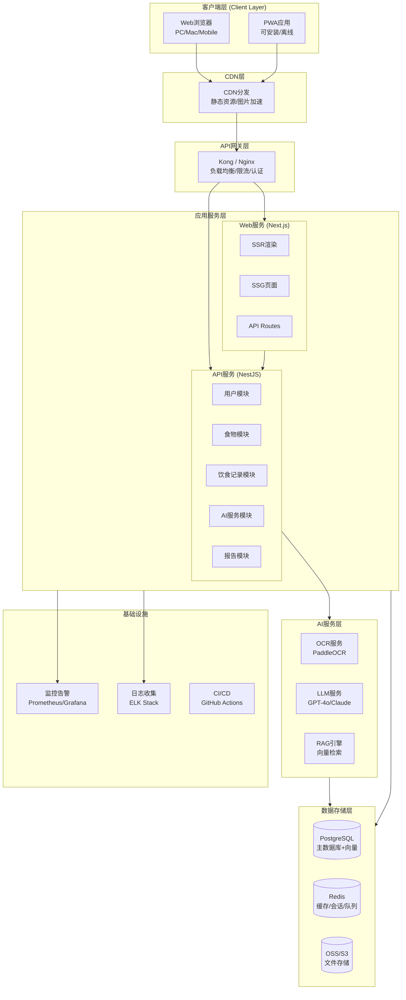
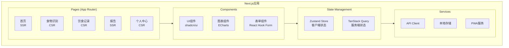
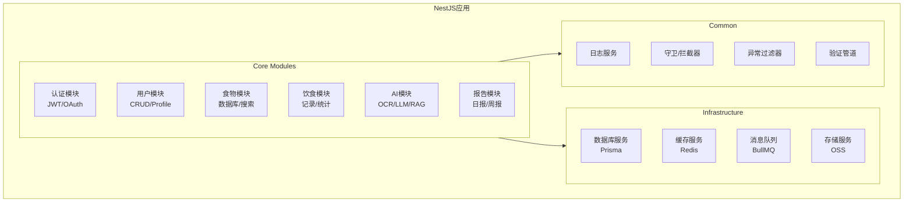
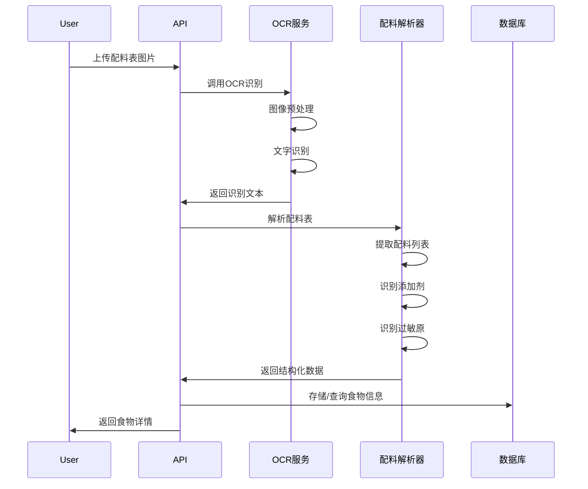
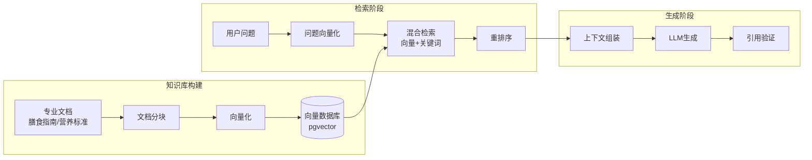
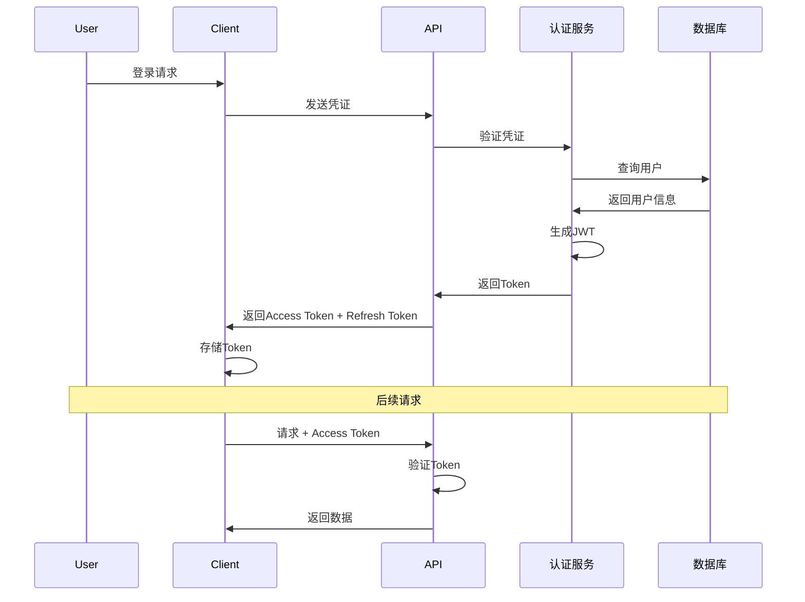
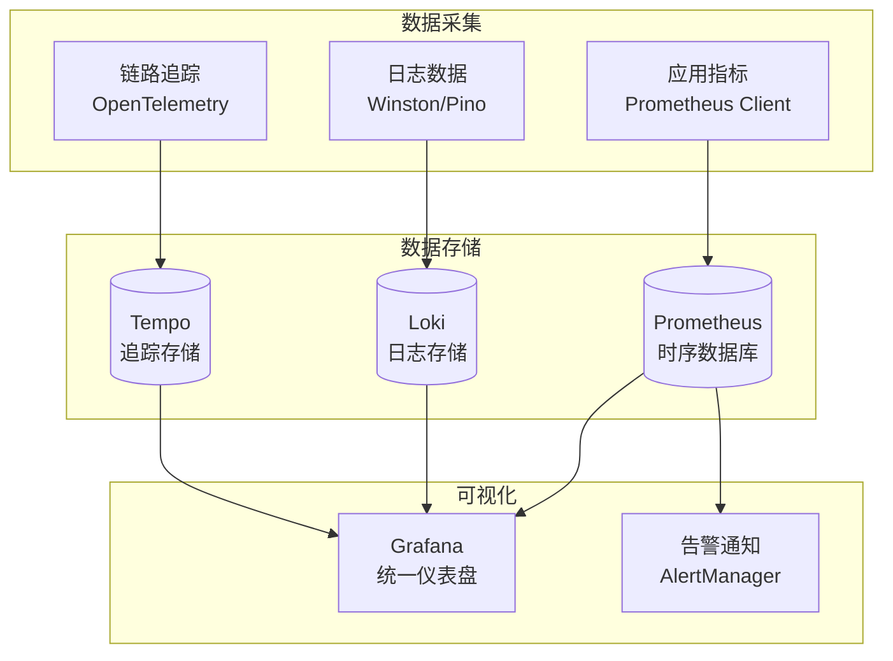
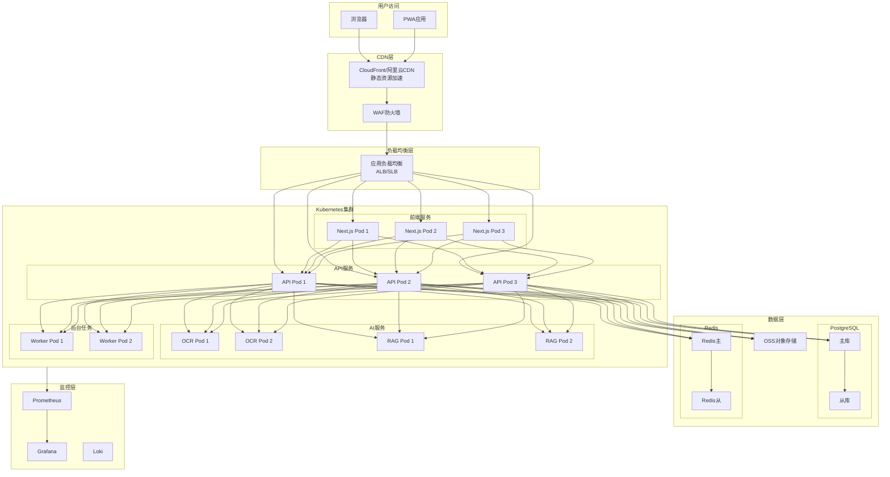
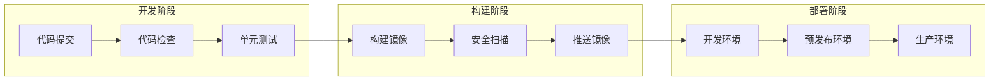

# 营养健康管家 Web应用 技术架构方案 v7.0

## 文档说明

本版本基于v6.0需求文档，结合2024-2025年行业主流技术趋势，对技术架构进行全面升级优化。重点解决性能瓶颈、技术债务问题，提升系统的可扩展性、可维护性和开发效率。

---

## 1. 当前架构分析（v6.0）

### 1.1 现有技术栈回顾

| 技术领域 | v6.0选型 | 说明 |
|---------|---------|------|
| 前端框架 | React 18 / Vue 3 | 二选一，未明确 |
| UI组件库 | Ant Design / Element Plus | 二选一，未明确 |
| 状态管理 | Redux Toolkit / Pinia | 二选一，未明确 |
| 后端框架 | Express / Koa / NestJS | 三选一，未明确 |
| 数据库 | PostgreSQL / MySQL | 二选一，未明确 |

### 1.2 问题识别

#### 1.2.1 技术选型模糊

**问题描述**：v6.0文档中多处使用"二选一"或"三选一"的表述，缺乏明确的技术决策。

**影响**：
- 开发团队难以统一技术栈
- 增加技术调研成本
- 可能导致架构不一致

#### 1.2.2 性能瓶颈

| 瓶颈点 | 问题描述 | 影响程度 |
|-------|---------|---------|
| 首屏加载 | 传统SPA首屏加载较慢，影响用户体验 | 高 |
| SEO支持 | CSR渲染不利于搜索引擎收录 | 中 |
| 图片处理 | 缺乏智能图片优化方案 | 中 |
| API响应 | 未明确缓存策略和优化方案 | 高 |

#### 1.2.3 技术债务

| 债务类型 | 具体问题 | 风险等级 |
|---------|---------|---------|
| 架构设计 | 缺乏微服务/模块化设计，单体应用难以扩展 | 高 |
| AI集成 | OCR和LLM集成方案不够具体 | 中 |
| 数据同步 | 跨设备数据同步机制不完善 | 中 |
| 监控告警 | 缺乏完善的监控和日志系统 | 中 |

#### 1.2.4 可扩展性问题

- **水平扩展困难**：单体架构难以应对用户增长
- **功能耦合**：各模块之间耦合度高，难以独立迭代
- **团队协作**：缺乏清晰的模块边界，多人协作困难

---

## 2. 技术趋势调研总结

### 2.1 前端技术趋势（2024-2025）

#### 2.1.1 框架演进

| 趋势 | 说明 | 推荐度 |
|-----|------|-------|
| React 19 + Next.js 15 | Server Components、混合渲染、性能优化 | ⭐⭐⭐⭐⭐ |
| Vue 3 + Nuxt 4 | Composition API、SSR优化、开发体验提升 | ⭐⭐⭐⭐⭐ |
| Svelte 5 + SvelteKit | 编译时优化、最小运行时、极致性能 | ⭐⭐⭐⭐ |

#### 2.1.2 渲染策略

现代Web应用采用混合渲染策略：

| 渲染方式 | 适用场景 | 性能特点 |
|---------|---------|---------|
| SSG（静态生成） | 营销页面、文档、博客 | 极快，CDN缓存 |
| SSR（服务端渲染） | SEO关键页面、首页 | 快，SEO友好 |
| ISR（增量静态再生） | 内容更新频繁的页面 | 平衡性能与实时性 |
| CSR（客户端渲染） | 交互密集型页面 | 流畅交互体验 |
| RSC（React Server Components） | 数据密集型组件 | 减少客户端JS |

#### 2.1.3 状态管理演进

| 方案 | 特点 | 推荐场景 |
|-----|------|---------|
| Zustand | 轻量、简单、TypeScript友好 | 中小型应用 |
| Jotai | 原子化状态、细粒度更新 | 复杂状态场景 |
| TanStack Query | 服务端状态管理、自动缓存 | 数据获取场景 |
| Pinia | Vue官方推荐、组合式API | Vue生态 |

### 2.2 后端技术趋势（2024-2025）

#### 2.2.1 Node.js框架性能对比

| 框架 | 性能(RPS) | 冷启动(ms) | 内存占用(MB) | 推荐场景 |
|-----|----------|-----------|-------------|---------|
| Fastify | ~48,000 | ~390 | ~90 | 高性能API |
| NestJS + Fastify | ~45,000 | ~400 | ~95 | 企业级应用 |
| Express | ~20,000 | ~380 | ~85 | 快速原型 |
| NestJS + Express | ~18,000 | ~815 | ~112 | 传统企业应用 |

#### 2.2.2 数据库选型

| 维度 | PostgreSQL | MySQL |
|-----|-----------|-------|
| 复杂查询性能 | ⭐⭐⭐⭐⭐ | ⭐⭐⭐⭐ |
| 读写混合场景 | ⭐⭐⭐⭐⭐ | ⭐⭐⭐⭐ |
| JSON支持 | ⭐⭐⭐⭐⭐ (JSONB) | ⭐⭐⭐ |
| 扩展性 | ⭐⭐⭐⭐⭐ (扩展生态) | ⭐⭐⭐ |
| 运维复杂度 | ⭐⭐⭐⭐ | ⭐⭐⭐⭐⭐ |
| 社区活跃度 | ⭐⭐⭐⭐⭐ | ⭐⭐⭐⭐⭐ |

**结论**：PostgreSQL更适合本项目的复杂查询、JSON数据存储和AI扩展需求。

### 2.3 AI技术趋势（2024-2025）

#### 2.3.1 OCR技术方案

| 方案 | 准确率 | 成本 | 延迟 | 推荐场景 |
|-----|-------|-----|------|---------|
| PaddleOCR | 95%+ | 低 | 低 | 自部署、高并发 |
| 百度OCR | 98%+ | 中 | 低 | 快速集成 |
| GPT-4V | 90%+ | 高 | 中 | 复杂场景理解 |
| LLMWhisperer | 95%+ | 中 | 低 | 文档布局保留 |

#### 2.3.2 RAG架构演进

现代RAG架构采用多阶段处理：

```
用户查询 → 意图识别 → 查询重写 → 混合检索 → 重排序 → 上下文组装 → LLM生成 → 答案验证
```

**关键技术点**：
- 混合检索：向量检索 + 关键词检索 + 知识图谱
- 重排序：使用Cross-Encoder对检索结果重排序
- 上下文优化：避免"lost-in-the-middle"问题
- 引用验证：确保答案可追溯

### 2.4 PWA技术趋势（2024-2025）

| 特性 | 成熟度 | 说明 |
|-----|-------|------|
| Service Worker | ⭐⭐⭐⭐⭐ | 离线缓存、后台同步 |
| Web App Manifest | ⭐⭐⭐⭐⭐ | 安装到主屏幕 |
| Background Sync | ⭐⭐⭐⭐ | 离线数据同步 |
| Periodic Background Sync | ⭐⭐⭐ | 定期后台更新 |
| Web Push | ⭐⭐⭐⭐ | 推送通知 |
| IndexedDB | ⭐⭐⭐⭐⭐ | 本地数据存储 |

---

## 3. v7.0技术架构设计

### 3.1 架构设计原则

| 原则 | 说明 | 实践方式 |
|-----|------|---------|
| 简单优先 | 选择成熟、易用的技术方案 | 优先选择有完善文档和社区支持的技术 |
| 渐进增强 | 核心功能优先，逐步添加高级特性 | MVP优先，迭代演进 |
| 关注点分离 | 前后端分离，模块解耦 | 清晰的模块边界和API契约 |
| 性能导向 | 性能作为架构设计的核心考量 | 性能预算、监控、优化 |
| 可观测性 | 完善的日志、监控、追踪体系 | 结构化日志、APM、分布式追踪 |

### 3.2 技术栈最终选型

#### 3.2.1 前端技术栈

| 技术领域 | 选型 | 选型依据 |
|---------|-----|---------|
| **框架** | Next.js 15 (React 19) | SSR/SSG/ISR混合渲染、Server Components、完善的PWA支持、优秀的开发体验 |
| **UI组件库** | shadcn/ui + Tailwind CSS | 高度可定制、无锁定、优秀的TypeScript支持、现代化设计 |
| **状态管理** | Zustand + TanStack Query | 轻量级客户端状态 + 服务端状态分离、优秀的开发体验 |
| **表单处理** | React Hook Form + Zod | 高性能表单、类型安全验证 |
| **图表库** | ECharts | 功能完善、性能优秀、中文文档完善 |
| **HTTP客户端** | 内置fetch + TanStack Query | 原生支持、自动缓存、重试机制 |
| **CSS方案** | Tailwind CSS | 原子化CSS、快速开发、优秀的响应式支持 |

**选型理由**：

1. **Next.js 15**：
   - 原生支持SSR/SSG/ISR，解决SEO和首屏加载问题
   - Server Components减少客户端JS体积
   - 内置图片优化、字体优化
   - 完善的PWA支持
   - 优秀的开发体验和文档

2. **shadcn/ui + Tailwind CSS**：
   - 组件代码完全可控，无第三方依赖锁定
   - 高度可定制，符合品牌设计需求
   - 优秀的TypeScript支持
   - 与Next.js完美集成

3. **Zustand + TanStack Query**：
   - Zustand极简，学习成本低
   - TanStack Query自动处理缓存、重试、乐观更新
   - 服务端状态与客户端状态分离

#### 3.2.2 后端技术栈

| 技术领域 | 选型 | 选型依据 |
|---------|-----|---------|
| **运行环境** | Node.js 22 LTS | 长期支持版本、性能优化 |
| **Web框架** | NestJS + Fastify适配器 | 企业级架构、模块化、TypeScript原生支持、高性能 |
| **数据库** | PostgreSQL 17 | 复杂查询支持、JSONB、扩展生态、AI向量扩展 |
| **ORM** | Prisma | 类型安全、优秀的迁移工具、自动生成类型 |
| **缓存** | Redis 7 | 高性能缓存、会话存储、消息队列 |
| **文件存储** | 阿里云OSS / AWS S3 | 云存储、CDN加速、成本优化 |
| **消息队列** | BullMQ (基于Redis) | 简单易用、与NestJS集成良好 |

**选型理由**：

1. **NestJS + Fastify**：
   - NestJS提供企业级架构模式（模块、依赖注入、装饰器）
   - Fastify适配器提供高性能HTTP处理
   - 完善的TypeScript支持
   - 丰富的生态系统（GraphQL、WebSocket、微服务）

2. **PostgreSQL 17**：
   - 复杂查询性能优秀
   - JSONB支持灵活的食品数据存储
   - pgvector扩展支持AI向量检索
   - 成熟的扩展生态

3. **Prisma**：
   - 类型安全的数据库访问
   - 优秀的迁移工具
   - 自动生成TypeScript类型
   - 直观的数据模型定义

#### 3.2.3 AI技术栈

| 技术领域 | 选型 | 选型依据 |
|---------|-----|---------|
| **OCR识别** | PaddleOCR（自部署）+ 百度OCR（备用） | 高准确率、低成本、可自部署 |
| **食物图像识别** | CLIP + 自训练分类模型 | 多模态理解、可扩展 |
| **AI营养师** | RAG架构 + GPT-4o / Claude 3.5 | 专业知识库、高质量回答 |
| **向量数据库** | pgvector (PostgreSQL扩展) | 与主数据库集成、简化架构 |
| **Embedding模型** | text-embedding-3-small | 高性价比、中文支持好 |

**选型理由**：

1. **PaddleOCR**：
   - 开源免费，可自部署
   - 支持中英文识别
   - 准确率高（95%+）
   - 支持表格识别

2. **RAG架构**：
   - 基于专业知识库回答，减少幻觉
   - 可追溯引用来源
   - 支持实时更新知识库
   - 成本可控

3. **pgvector**：
   - 与PostgreSQL无缝集成
   - 简化技术栈
   - 支持向量索引（IVFFlat、HNSW）

### 3.3 整体架构图



### 3.4 核心模块架构

#### 3.4.1 前端模块架构



#### 3.4.2 后端模块架构



### 3.5 数据架构设计

#### 3.5.1 数据库Schema设计

```prisma
// 用户表
model User {
  id            String    @id @default(cuid())
  phone         String?   @unique
  email         String?   @unique
  passwordHash  String?
  nickname      String?
  avatar        String?
  gender        Gender?
  birthDate     DateTime?
  height        Float?
  weight        Float?
  
  // 健康信息
  activityLevel ActivityLevel @default(SENDENTARY)
  healthConditions HealthCondition[]
  allergies     Allergen[]
  
  // 目标设置
  goalType      GoalType  @default(MAINTAIN)
  targetWeight  Float?
  dailyCalorieGoal Float?
  nutritionGoals Json?
  
  // 计算字段
  bmr           Float?
  tdee          Float?
  bmi           Float?
  
  // 关联
  dietRecords   DietRecord[]
  foodFavorites FoodFavorite[]
  
  createdAt     DateTime  @default(now())
  updatedAt     DateTime  @updatedAt
}

// 食物表
model Food {
  id            String    @id @default(cuid())
  name          String
  brand         String?
  category      String
  barcode       String?   @unique
  image         String?
  
  // 营养成分 (每100g)
  calories      Float
  protein       Float
  fat           Float
  saturatedFat  Float?
  carbs         Float
  fiber         Float?
  sugar         Float?
  sodium        Float
  potassium     Float?
  vitamins      Json?
  minerals      Json?
  
  // 配料信息
  ingredients   String?
  additives     Json?
  allergens     Json?
  
  // 评估数据
  healthScore   Float?
  novaClass     Int?
  glycemicIndex Float?
  proteinQuality Float?
  
  // 特定人群评分
  weightLossScore   Float?
  muscleGainScore   Float?
  diabetesScore     Float?
  hypertensionScore Float?
  
  // 向量嵌入 (用于语义搜索)
  embedding     Float[]?
  
  // 关联
  dietRecords   DietRecordItem[]
  favorites     FoodFavorite[]
  
  createdAt     DateTime  @default(now())
  updatedAt     DateTime  @updatedAt
  
  @@index([name])
  @@index([barcode])
  @@index([category])
}

// 饮食记录表
model DietRecord {
  id            String    @id @default(cuid())
  userId        String
  date          DateTime  @db.Date
  mealType      MealType
  
  user          User      @relation(fields: [userId], references: [id])
  foods         DietRecordItem[]
  
  createdAt     DateTime  @default(now())
  
  @@index([userId, date])
  @@index([userId, date, mealType])
}

// 记录项表
model DietRecordItem {
  id            String    @id @default(cuid())
  recordId      String
  foodId        String
  amount        Float     // 克数
  
  record        DietRecord @relation(fields: [recordId], references: [id])
  food          Food      @relation(fields: [foodId], references: [id])
}

// AI对话历史表
model AIConversation {
  id            String    @id @default(cuid())
  userId        String
  sessionId     String
  
  messages      Json      // 对话消息数组
  
  createdAt     DateTime  @default(now())
  
  @@index([userId])
  @@index([sessionId])
}
```

#### 3.5.2 缓存策略

| 数据类型 | 缓存策略 | TTL | 说明 |
|---------|---------|-----|------|
| 食物营养数据 | Cache-Aside | 24h | 变化频率低 |
| 用户会话 | Write-Through | 7天 | JWT刷新令牌 |
| 今日营养统计 | Write-Behind | 5分钟 | 实时性要求高 |
| AI对话上下文 | Cache-Aside | 1小时 | 会话期间有效 |
| 热门食物列表 | Cache-Aside | 1小时 | 首页展示 |

#### 3.5.3 向量检索设计

```sql
-- 启用pgvector扩展
CREATE EXTENSION IF NOT EXISTS vector;

-- 创建向量索引
CREATE INDEX ON food USING ivfflat (embedding vector_cosine_ops) WITH (lists = 100);

-- 语义搜索函数
CREATE OR REPLACE FUNCTION search_foods(
  query_embedding vector,
  limit_count int DEFAULT 10
)
RETURNS TABLE (
  id text,
  name text,
  similarity float
)
LANGUAGE plpgsql
AS $$
BEGIN
  RETURN QUERY
  SELECT 
    f.id::text,
    f.name,
    1 - (f.embedding <=> query_embedding) as similarity
  FROM food f
  ORDER BY f.embedding <=> query_embedding
  LIMIT limit_count;
END;
$$;
```

### 3.6 AI服务架构

#### 3.6.1 OCR服务架构



#### 3.6.2 RAG架构设计



**RAG核心组件**：

| 组件 | 技术选型 | 说明 |
|-----|---------|------|
| 文档加载 | LangChain Document Loaders | 支持PDF、Markdown等格式 |
| 文本分块 | RecursiveCharacterTextSplitter | 保持语义完整性 |
| Embedding | text-embedding-3-small | 高性价比、中文支持 |
| 向量存储 | pgvector | 与主数据库集成 |
| 检索策略 | 混合检索 | 向量检索 + BM25 |
| 重排序 | Cohere Rerank / Cross-Encoder | 提升检索精度 |
| LLM | GPT-4o / Claude 3.5 Sonnet | 高质量回答 |

### 3.7 PWA架构设计

#### 3.7.1 Service Worker策略

```javascript
// 缓存策略配置
const cacheStrategies = {
  // 静态资源：Cache First
  static: {
    cacheName: 'static-v1',
    strategy: 'CacheFirst',
    expiration: {
      maxEntries: 100,
      maxAgeSeconds: 30 * 24 * 60 * 60, // 30天
    },
  },
  
  // API请求：Network First
  api: {
    cacheName: 'api-v1',
    strategy: 'NetworkFirst',
    networkTimeoutSeconds: 10,
    expiration: {
      maxEntries: 50,
      maxAgeSeconds: 24 * 60 * 60, // 1天
    },
  },
  
  // 图片：Cache First with Network Update
  images: {
    cacheName: 'images-v1',
    strategy: 'CacheFirst',
    expiration: {
      maxEntries: 60,
      maxAgeSeconds: 7 * 24 * 60 * 60, // 7天
    },
  },
};
```

#### 3.7.2 离线功能设计

| 功能 | 离线支持 | 实现方式 |
|-----|---------|---------|
| 查看今日记录 | ✅ | IndexedDB本地存储 |
| 添加食物记录 | ✅ | 后台同步队列 |
| 查看历史记录 | ✅ | 缓存最近30天数据 |
| 食物搜索 | ⚠️ 部分 | 缓存常用食物 |
| AI营养师 | ❌ | 需要网络 |
| 数据报告 | ⚠️ 部分 | 缓存最近报告 |

### 3.8 安全架构设计

#### 3.8.1 认证授权



#### 3.8.2 安全措施

| 安全领域 | 措施 | 实现方式 |
|---------|-----|---------|
| 传输安全 | HTTPS + HSTS | 强制HTTPS，HSTS头部 |
| 认证安全 | JWT + Refresh Token | 短期Access Token，长期Refresh Token |
| 密码安全 | bcrypt + 盐值 | 哈希强度12 |
| XSS防护 | CSP + 输入过滤 | Content-Security-Policy头部 |
| CSRF防护 | SameSite Cookie + Token | 双重验证 |
| SQL注入 | Prisma参数化查询 | ORM自动处理 |
| 限流 | 滑动窗口限流 | Redis + 限流中间件 |
| 敏感数据 | AES-256加密 | 手机号、邮箱加密存储 |

---

## 4. 性能优化方案

### 4.1 前端性能优化

#### 4.1.1 性能预算

| 指标 | 目标值 | 测量方式 |
|-----|-------|---------|
| LCP (Largest Contentful Paint) | ≤ 2.0s | Lighthouse |
| FID (First Input Delay) | ≤ 100ms | Lighthouse |
| CLS (Cumulative Layout Shift) | ≤ 0.1 | Lighthouse |
| TTI (Time to Interactive) | ≤ 3.8s | Lighthouse |
| 首屏JS体积 | ≤ 150KB | webpack-bundle-analyzer |
| 总页面体积 | ≤ 1MB | Network面板 |

#### 4.1.2 优化策略

| 优化项 | 策略 | 预期收益 |
|-------|-----|---------|
| 代码分割 | 动态import、路由级别分割 | 减少30%首屏体积 |
| 图片优化 | Next.js Image组件、WebP格式 | 减少50%图片体积 |
| 字体优化 | 字体子集化、font-display:swap | 减少字体加载阻塞 |
| 缓存策略 | Service Worker + HTTP缓存 | 二次访问秒开 |
| 预加载 | 关键资源preload/prefetch | 减少请求延迟 |
| 服务端渲染 | SSR/SSG关键页面 | 提升首屏速度和SEO |

### 4.2 后端性能优化

#### 4.2.1 API性能目标

| 指标 | 目标值 | 说明 |
|-----|-------|------|
| P50响应时间 | ≤ 100ms | 50%请求响应时间 |
| P95响应时间 | ≤ 300ms | 95%请求响应时间 |
| P99响应时间 | ≤ 500ms | 99%请求响应时间 |
| 吞吐量 | ≥ 1000 RPS | 单实例吞吐量 |
| 错误率 | ≤ 0.1% | 请求失败率 |

#### 4.2.2 优化策略

| 优化项 | 策略 | 预期收益 |
|-------|-----|---------|
| 数据库查询 | 索引优化、查询计划分析 | 减少50%查询时间 |
| 连接池 | PgBouncer连接池 | 减少连接开销 |
| 缓存 | Redis多级缓存 | 减少70%数据库查询 |
| 异步处理 | BullMQ消息队列 | 提升API响应速度 |
| 压缩 | Gzip/Brotli压缩 | 减少60%传输体积 |
| CDN | 静态资源CDN加速 | 减少网络延迟 |

### 4.3 AI服务性能优化

| 优化项 | 策略 | 预期收益 |
|-------|-----|---------|
| OCR批处理 | 图片预处理 + 批量识别 | 提升吞吐量 |
| 向量检索 | IVFFlat索引 | 检索时间<50ms |
| LLM缓存 | 相似问题缓存 | 减少50% LLM调用 |
| 流式输出 | SSE流式响应 | 提升用户体验 |
| 模型量化 | INT8量化 | 减少推理延迟 |

---

## 5. 可观测性设计

### 5.1 监控体系



### 5.2 关键指标

#### 5.2.1 应用指标

| 指标类型 | 指标名称 | 说明 |
|---------|---------|------|
| 请求指标 | http_request_duration_seconds | HTTP请求延迟 |
| 请求指标 | http_requests_total | HTTP请求总数 |
| 请求指标 | http_request_errors_total | HTTP错误总数 |
| 业务指标 | user_registrations_total | 用户注册数 |
| 业务指标 | food_scans_total | 食物扫描次数 |
| 业务指标 | ai_conversations_total | AI对话次数 |
| 资源指标 | nodejs_memory_usage_bytes | 内存使用 |
| 资源指标 | nodejs_cpu_usage_seconds | CPU使用 |

#### 5.2.2 数据库指标

| 指标名称 | 说明 | 告警阈值 |
|---------|-----|---------|
| pg_stat_activity_count | 活跃连接数 | > 80% 最大连接数 |
| pg_stat_database_deadlocks | 死锁次数 | > 0 |
| pg_replication_lag_seconds | 复制延迟 | > 10s |
| query_duration_seconds | 查询延迟 | P99 > 1s |

#### 5.2.3 Redis指标

| 指标名称 | 说明 | 告警阈值 |
|---------|-----|---------|
| redis_memory_usage_bytes | 内存使用 | > 80% 最大内存 |
| redis_connected_clients | 连接数 | > 80% 最大连接数 |
| redis_keyspace_hits_rate | 缓存命中率 | < 80% |
| redis_blocked_clients | 阻塞客户端 | > 10 |

### 5.3 日志规范

#### 5.3.1 日志格式

```json
{
  "timestamp": "2024-03-28T10:00:00.000Z",
  "level": "info",
  "service": "nutrition-api",
  "traceId": "abc123",
  "spanId": "def456",
  "userId": "user_001",
  "message": "Food scanned successfully",
  "context": {
    "foodId": "food_001",
    "scanType": "barcode",
    "duration": 150
  }
}
```

#### 5.3.2 日志级别

| 级别 | 使用场景 | 示例 |
|-----|---------|------|
| ERROR | 系统错误、异常 | 数据库连接失败 |
| WARN | 潜在问题 | API响应超时 |
| INFO | 关键业务事件 | 用户登录、食物扫描 |
| DEBUG | 调试信息 | 详细请求参数 |

### 5.4 告警规则

| 告警名称 | 条件 | 严重程度 | 通知方式 |
|---------|-----|---------|---------|
| API错误率过高 | 错误率 > 1% | 严重 | 电话 + 短信 |
| API响应过慢 | P99 > 1s | 警告 | 短信 |
| 数据库连接池耗尽 | 连接数 > 90% | 严重 | 电话 + 短信 |
| Redis内存不足 | 内存使用 > 90% | 警告 | 短信 |
| 磁盘空间不足 | 磁盘使用 > 85% | 警告 | 短信 |

---

## 6. 部署架构

### 6.1 生产环境架构



### 6.2 容器化配置

#### 6.2.1 Dockerfile示例

```dockerfile
# 前端 Dockerfile
FROM node:22-alpine AS builder
WORKDIR /app
COPY package*.json ./
RUN npm ci
COPY . .
RUN npm run build

FROM node:22-alpine AS runner
WORKDIR /app
ENV NODE_ENV=production
RUN addgroup --system --gid 1001 nodejs
RUN adduser --system --uid 1001 nextjs

COPY --from=builder /app/public ./public
COPY --from=builder --chown=nextjs:nodejs /app/.next/standalone ./
COPY --from=builder --chown=nextjs:nodejs /app/.next/static ./.next/static

USER nextjs
EXPOSE 3000
ENV PORT=3000

CMD ["node", "server.js"]
```

```dockerfile
# 后端 Dockerfile
FROM node:22-alpine AS builder
WORKDIR /app
COPY package*.json ./
RUN npm ci
COPY . .
RUN npm run build

FROM node:22-alpine AS runner
WORKDIR /app
ENV NODE_ENV=production

RUN addgroup --system --gid 1001 nodejs
RUN adduser --system --uid 1001 nestjs

COPY --from=builder --chown=nestjs:nodejs /app/dist ./dist
COPY --from=builder --chown=nestjs:nodejs /app/node_modules ./node_modules
COPY --from=builder --chown=nestjs:nodejs /app/package.json ./

USER nestjs
EXPOSE 3000

CMD ["node", "dist/main.js"]
```

#### 6.2.2 Kubernetes部署配置

```yaml
# API服务部署
apiVersion: apps/v1
kind: Deployment
metadata:
  name: nutrition-api
  labels:
    app: nutrition-api
spec:
  replicas: 3
  selector:
    matchLabels:
      app: nutrition-api
  template:
    metadata:
      labels:
        app: nutrition-api
    spec:
      containers:
      - name: api
        image: nutrition-api:latest
        ports:
        - containerPort: 3000
        resources:
          requests:
            memory: "256Mi"
            cpu: "250m"
          limits:
            memory: "512Mi"
            cpu: "500m"
        env:
        - name: DATABASE_URL
          valueFrom:
            secretKeyRef:
              name: nutrition-secrets
              key: database-url
        - name: REDIS_URL
          valueFrom:
            secretKeyRef:
              name: nutrition-secrets
              key: redis-url
        livenessProbe:
          httpGet:
            path: /health
            port: 3000
          initialDelaySeconds: 30
          periodSeconds: 10
        readinessProbe:
          httpGet:
            path: /health/ready
            port: 3000
          initialDelaySeconds: 5
          periodSeconds: 5
```

### 6.3 CI/CD流程



---

## 7. 实施路径

### 7.1 分阶段实施计划

#### 第一阶段：基础设施搭建（2周）

| 任务 | 说明 | 交付物 |
|-----|------|-------|
| 开发环境配置 | 本地开发环境、Docker Compose | 开发环境文档 |
| CI/CD配置 | GitHub Actions流水线 | CI/CD配置文件 |
| 基础服务部署 | PostgreSQL、Redis | 数据库服务 |
| 监控系统搭建 | Prometheus、Grafana | 监控仪表盘 |

#### 第二阶段：核心功能开发（6周）

| 周次 | 前端任务 | 后端任务 |
|-----|---------|---------|
| 1-2 | 项目初始化、UI组件库集成、基础页面 | 项目初始化、数据库Schema、认证模块 |
| 3-4 | 食物识别页面、饮食记录页面 | 食物模块、饮食记录模块、API开发 |
| 5-6 | 营养数据中心、报告页面 | 报告模块、数据统计API |

#### 第三阶段：AI功能开发（4周）

| 周次 | 任务 | 交付物 |
|-----|------|-------|
| 1-2 | OCR服务集成、配料解析 | OCR识别功能 |
| 3-4 | RAG架构搭建、AI营养师 | AI对话功能 |

#### 第四阶段：优化与测试（3周）

| 周次 | 任务 | 交付物 |
|-----|------|-------|
| 1 | 性能优化、PWA完善 | 性能报告 |
| 2 | 安全测试、渗透测试 | 安全报告 |
| 3 | 压力测试、Bug修复 | 测试报告 |

#### 第五阶段：上线与运营（1周）

| 任务 | 说明 | 交付物 |
|-----|------|-------|
| 生产环境部署 | K8s部署、域名配置 | 生产环境 |
| 监控配置 | 告警规则、仪表盘 | 监控系统 |
| 文档完善 | API文档、运维文档 | 技术文档 |

### 7.2 技术债务清理计划

| 债务项 | 清理方案 | 优先级 | 预计工作量 |
|-------|---------|-------|-----------|
| 技术选型模糊 | 本文档已明确 | 高 | 已完成 |
| 缺乏监控体系 | 引入Prometheus+Grafana | 高 | 1周 |
| AI集成方案不具体 | 本文档已设计RAG架构 | 高 | 已完成 |
| 数据同步机制不完善 | PWA离线同步设计 | 中 | 2周 |
| 缺乏测试覆盖 | 单元测试、E2E测试 | 中 | 持续 |

### 7.3 风险与应对

| 风险 | 影响 | 概率 | 应对措施 |
|-----|-----|------|---------|
| OCR准确率不达标 | 用户体验差 | 中 | 多OCR引擎备份、人工校正机制 |
| LLM成本过高 | 运营成本高 | 中 | 缓存策略、模型选择优化 |
| 性能不达标 | 用户流失 | 低 | 性能预算、持续优化 |
| 安全漏洞 | 数据泄露 | 低 | 安全审计、渗透测试 |

---

## 8. 技术选型对比总结

### 8.1 前端技术选型对比

| 维度 | Next.js 15 | Nuxt 4 | SvelteKit |
|-----|-----------|--------|-----------|
| 学习曲线 | 中（需React基础） | 中（需Vue基础） | 低 |
| 性能 | ⭐⭐⭐⭐⭐ | ⭐⭐⭐⭐⭐ | ⭐⭐⭐⭐⭐ |
| 生态成熟度 | ⭐⭐⭐⭐⭐ | ⭐⭐⭐⭐ | ⭐⭐⭐⭐ |
| SSR支持 | ⭐⭐⭐⭐⭐ | ⭐⭐⭐⭐⭐ | ⭐⭐⭐⭐⭐ |
| PWA支持 | ⭐⭐⭐⭐⭐ | ⭐⭐⭐⭐ | ⭐⭐⭐⭐ |
| TypeScript | ⭐⭐⭐⭐⭐ | ⭐⭐⭐⭐⭐ | ⭐⭐⭐⭐⭐ |
| 企业采用度 | ⭐⭐⭐⭐⭐ | ⭐⭐⭐⭐ | ⭐⭐⭐ |
| **推荐度** | **⭐⭐⭐⭐⭐** | ⭐⭐⭐⭐⭐ | ⭐⭐⭐⭐ |

**结论**：推荐 **Next.js 15**，基于以下考虑：
- React生态成熟，人才储备充足
- SSR/SSG/ISR支持完善
- PWA支持优秀
- 企业采用度高，案例丰富

### 8.2 后端框架选型对比

| 维度 | NestJS + Fastify | Express | Fastify |
|-----|-----------------|---------|---------|
| 性能 | ⭐⭐⭐⭐⭐ | ⭐⭐⭐ | ⭐⭐⭐⭐⭐ |
| 架构规范 | ⭐⭐⭐⭐⭐ | ⭐⭐⭐ | ⭐⭐⭐ |
| TypeScript | ⭐⭐⭐⭐⭐ | ⭐⭐⭐ | ⭐⭐⭐⭐⭐ |
| 学习曲线 | 中 | 低 | 低 |
| 企业级特性 | ⭐⭐⭐⭐⭐ | ⭐⭐⭐ | ⭐⭐⭐ |
| 生态丰富度 | ⭐⭐⭐⭐⭐ | ⭐⭐⭐⭐⭐ | ⭐⭐⭐⭐ |
| **推荐度** | **⭐⭐⭐⭐⭐** | ⭐⭐⭐ | ⭐⭐⭐⭐ |

**结论**：推荐 **NestJS + Fastify适配器**，基于以下考虑：
- 企业级架构模式，适合团队协作
- Fastify适配器提供高性能
- 完善的TypeScript支持
- 丰富的生态系统

### 8.3 数据库选型对比

| 维度 | PostgreSQL 17 | MySQL 8 |
|-----|--------------|---------|
| 复杂查询性能 | ⭐⭐⭐⭐⭐ | ⭐⭐⭐⭐ |
| JSON支持 | ⭐⭐⭐⭐⭐ | ⭐⭐⭐ |
| 扩展性 | ⭐⭐⭐⭐⭐ | ⭐⭐⭐ |
| AI向量支持 | ⭐⭐⭐⭐⭐ (pgvector) | ⭐⭐ |
| 运维复杂度 | ⭐⭐⭐⭐ | ⭐⭐⭐⭐⭐ |
| 社区活跃度 | ⭐⭐⭐⭐⭐ | ⭐⭐⭐⭐⭐ |
| **推荐度** | **⭐⭐⭐⭐⭐** | ⭐⭐⭐⭐ |

**结论**：推荐 **PostgreSQL 17**，基于以下考虑：
- 复杂查询性能优秀
- JSONB支持灵活的数据存储
- pgvector扩展支持AI向量检索
- 扩展生态丰富

---

## 9. 附录

### 9.1 技术栈清单

| 分类 | 技术 | 版本 | 用途 |
|-----|-----|------|------|
| **前端** | | | |
| 框架 | Next.js | 15.x | 全栈React框架 |
| UI库 | React | 19.x | UI组件开发 |
| 组件库 | shadcn/ui | latest | UI组件 |
| 样式 | Tailwind CSS | 3.x | CSS框架 |
| 状态管理 | Zustand | 4.x | 客户端状态 |
| 数据获取 | TanStack Query | 5.x | 服务端状态 |
| 表单 | React Hook Form | 7.x | 表单处理 |
| 验证 | Zod | 3.x | Schema验证 |
| 图表 | ECharts | 5.x | 数据可视化 |
| **后端** | | | |
| 运行时 | Node.js | 22 LTS | JavaScript运行时 |
| 框架 | NestJS | 10.x | 后端框架 |
| HTTP适配器 | Fastify | 4.x | 高性能HTTP |
| ORM | Prisma | 5.x | 数据库ORM |
| 验证 | class-validator | 0.14.x | 数据验证 |
| **数据库** | | | |
| 关系数据库 | PostgreSQL | 17.x | 主数据库 |
| 向量扩展 | pgvector | 0.7.x | 向量检索 |
| 缓存 | Redis | 7.x | 缓存/队列 |
| **AI** | | | |
| OCR | PaddleOCR | 2.8.x | 文字识别 |
| LLM | OpenAI API | - | GPT-4o |
| Embedding | text-embedding-3-small | - | 文本向量化 |
| **基础设施** | | | |
| 容器 | Docker | 24.x | 容器化 |
| 编排 | Kubernetes | 1.28+ | 容器编排 |
| 监控 | Prometheus | 2.x | 指标监控 |
| 可视化 | Grafana | 10.x | 监控仪表盘 |
| 日志 | Loki | 2.x | 日志聚合 |
| 追踪 | OpenTelemetry | - | 分布式追踪 |

### 9.2 参考资料

1. Next.js官方文档 - https://nextjs.org/docs
2. NestJS官方文档 - https://docs.nestjs.com
3. PostgreSQL官方文档 - https://www.postgresql.org/docs/17/
4. pgvector文档 - https://github.com/pgvector/pgvector
5. PaddleOCR文档 - https://github.com/PaddlePaddle/PaddleOCR
6. TanStack Query文档 - https://tanstack.com/query
7. Prisma文档 - https://www.prisma.io/docs
8. OpenTelemetry文档 - https://opentelemetry.io/docs

### 9.3 版本历史

| 版本 | 日期 | 变更内容 |
|-----|------|---------|
| v7.0 | 2024-03-28 | 初始版本，基于v6.0需求文档进行全面技术架构设计 |
