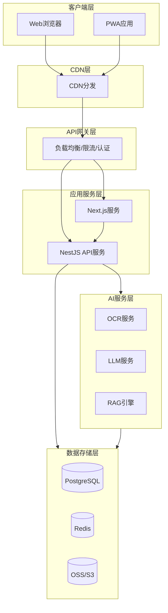

# 营养健康管家 Web应用 技术架构方案 v3.0

## 文档说明

本文档为开发团队提供技术架构指导，包含技术选型、架构设计、数据库设计、核心实现方案等开发必需内容。

---

## 1. 技术栈选型

### 1.1 前端技术栈

| 技术领域 | 选型 | 版本 |
|---------|-----|------|
| **框架** | Next.js | 15.x |
| **UI库** | React | 19.x |
| **组件库** | shadcn/ui + Tailwind CSS | 3.x |
| **状态管理** | Zustand + TanStack Query | 4.x / 5.x |
| **表单** | React Hook Form + Zod | 7.x / 3.x |
| **图表** | ECharts | 5.x |

### 1.2 后端技术栈

| 技术领域 | 选型 | 版本 |
|---------|-----|------|
| **运行时** | Node.js | 22 LTS |
| **框架** | NestJS + Fastify适配器 | 10.x |
| **ORM** | Prisma | 5.x |
| **数据库** | PostgreSQL + pgvector | 17.x |
| **缓存** | Redis | 7.x |
| **消息队列** | BullMQ | - |
| **文件存储** | 阿里云OSS / AWS S3 | - |

### 1.3 AI技术栈

| 技术领域 | 选型 | 说明 |
|---------|-----|------|
| **OCR** | PaddleOCR（主）+ 百度OCR（备） | 自部署，95%+准确率 |
| **LLM** | GPT-4o / Claude 3.5 | AI营养师 |
| **向量数据库** | pgvector | 与PostgreSQL集成 |
| **Embedding** | text-embedding-3-small | 中文支持好 |

---

## 2. 整体架构



---

## 3. 数据库设计

### 3.1 Schema定义

```prisma
enum Gender {
  MALE
  FEMALE
}

enum ActivityLevel {
  SENDENTARY
  LIGHT
  MODERATE
  ACTIVE
  VERY_ACTIVE
}

enum GoalType {
  WEIGHT_LOSS
  MUSCLE_GAIN
  HEALTH_MANAGEMENT
  MAINTAIN
}

enum MealType {
  BREAKFAST
  LUNCH
  DINNER
  SNACK
}

model User {
  id              String    @id @default(cuid())
  phone           String?   @unique
  email           String?   @unique
  passwordHash    String?
  nickname        String?
  avatar          String?
  gender          Gender?
  birthDate       DateTime?
  height          Float?
  weight          Float?
  activityLevel   ActivityLevel @default(SENDENTARY)
  healthConditions Json?
  allergies       Json?
  goalType        GoalType  @default(MAINTAIN)
  targetWeight    Float?
  dailyCalorieGoal Float?
  nutritionGoals  Json?
  bmr             Float?
  tdee            Float?
  bmi             Float?
  dietRecords     DietRecord[]
  foodFavorites   FoodFavorite[]
  createdAt       DateTime  @default(now())
  updatedAt       DateTime  @updatedAt
}

model Food {
  id              String    @id @default(cuid())
  name            String
  brand           String?
  category        String
  barcode         String?   @unique
  image           String?
  calories        Float
  protein         Float
  fat             Float
  saturatedFat    Float?
  carbs           Float
  fiber           Float?
  sugar           Float?
  sodium          Float
  potassium       Float?
  vitamins        Json?
  minerals        Json?
  ingredients     String?
  additives       Json?
  allergens       Json?
  healthScore     Float?
  novaClass       Int?
  glycemicIndex   Float?
  weightLossScore Float?
  muscleGainScore Float?
  diabetesScore   Float?
  hypertensionScore Float?
  embedding       Float[]?
  dietRecords     DietRecordItem[]
  favorites       FoodFavorite[]
  createdAt       DateTime  @default(now())
  updatedAt       DateTime  @updatedAt

  @@index([name])
  @@index([barcode])
  @@index([category])
}

model DietRecord {
  id          String    @id @default(cuid())
  userId      String
  date        DateTime  @db.Date
  mealType    MealType
  user        User      @relation(fields: [userId], references: [id])
  foods       DietRecordItem[]
  createdAt   DateTime  @default(now())

  @@index([userId, date])
  @@index([userId, date, mealType])
}

model DietRecordItem {
  id        String    @id @default(cuid())
  recordId  String
  foodId    String
  amount    Float
  record    DietRecord @relation(fields: [recordId], references: [id], onDelete: Cascade)
  food      Food      @relation(fields: [foodId], references: [id])
}

model FoodFavorite {
  id        String   @id @default(cuid())
  userId    String
  foodId    String
  user      User     @relation(fields: [userId], references: [id], onDelete: Cascade)
  food      Food     @relation(fields: [foodId], references: [id], onDelete: Cascade)
  createdAt DateTime @default(now())

  @@unique([userId, foodId])
}

model AIConversation {
  id        String   @id @default(cuid())
  userId    String
  sessionId String
  messages  Json
  createdAt DateTime @default(now())

  @@index([userId])
  @@index([sessionId])
}
```

### 3.2 缓存策略

| 数据类型 | 缓存策略 | TTL | Key格式 |
|---------|---------|-----|---------|
| 食物营养数据 | Cache-Aside | 24h | `food:{id}` |
| 用户会话 | Write-Through | 7天 | `session:{userId}` |
| 今日营养统计 | Write-Behind | 5分钟 | `stats:{userId}:{date}` |
| AI对话上下文 | Cache-Aside | 1小时 | `chat:{sessionId}` |
| 热门食物列表 | Cache-Aside | 1小时 | `foods:popular` |

### 3.3 向量检索

```sql
CREATE EXTENSION IF NOT EXISTS vector;

CREATE INDEX ON food USING ivfflat (embedding vector_cosine_ops) WITH (lists = 100);

CREATE OR REPLACE FUNCTION search_foods(
  query_embedding vector,
  limit_count int DEFAULT 10
)
RETURNS TABLE (id text, name text, similarity float)
LANGUAGE plpgsql AS $$
BEGIN
  RETURN QUERY
  SELECT 
    f.id::text, f.name,
    1 - (f.embedding <=> query_embedding) as similarity
  FROM food f
  ORDER BY f.embedding <=> query_embedding
  LIMIT limit_count;
END;
$$;
```

---

## 4. AI服务架构

### 4.1 OCR服务流程

```
用户上传图片 → 图像预处理 → OCR识别 → 配料解析 → 结构化数据 → 返回结果
```

**关键实现**：
- 图片预处理：灰度化、二值化、去噪
- 配料解析：正则匹配 + NLP识别添加剂、过敏原
- 备用方案：百度OCR API

### 4.2 RAG架构

```
知识库构建：专业文档 → 分块 → 向量化 → pgvector存储
检索流程：用户问题 → 向量化 → 混合检索 → 重排序 → 上下文组装 → LLM生成
```

**RAG组件配置**：

| 组件 | 选型 | 说明 |
|-----|------|------|
| 文档加载 | LangChain Loaders | PDF/Markdown |
| 文本分块 | RecursiveCharacterTextSplitter | chunk_size=500, overlap=50 |
| Embedding | text-embedding-3-small | 1536维 |
| 检索策略 | 向量 + BM25混合 | top_k=10 |
| LLM | GPT-4o | temperature=0.7 |

---

## 5. 安全措施

| 安全领域 | 措施 | 实现 |
|---------|-----|------|
| 传输安全 | HTTPS + HSTS | 强制HTTPS |
| 认证 | JWT + Refresh Token | Access Token 15分钟，Refresh Token 7天 |
| 密码 | bcrypt | 强度12 |
| XSS | CSP + 输入过滤 | Content-Security-Policy |
| CSRF | SameSite Cookie + Token | 双重验证 |
| SQL注入 | Prisma参数化 | ORM自动处理 |
| 限流 | 滑动窗口 | 100次/分钟/IP |
| 敏感数据 | AES-256 | 手机号、邮箱加密 |

---

## 6. 性能优化

### 6.1 前端性能目标

| 指标 | 目标值 |
|-----|-------|
| LCP | ≤ 2.0s |
| FID | ≤ 100ms |
| CLS | ≤ 0.1 |
| 首屏JS | ≤ 150KB |

### 6.2 后端性能目标

| 指标 | 目标值 |
|-----|-------|
| P50响应 | ≤ 100ms |
| P95响应 | ≤ 300ms |
| 吞吐量 | ≥ 1000 RPS |
| 错误率 | ≤ 0.1% |

### 6.3 优化策略

| 类型 | 策略 |
|-----|------|
| 前端 | 代码分割、图片WebP、字体子集化、SSR/SSG |
| 后端 | 数据库索引、Redis缓存、连接池、Gzip压缩 |
| AI | OCR批处理、向量索引、LLM缓存、流式输出 |

---

## 7. PWA离线功能

| 功能 | 离线支持 | 实现方式 |
|-----|---------|---------|
| 查看今日记录 | ✅ | IndexedDB |
| 添加食物记录 | ✅ | 后台同步队列 |
| 查看历史记录 | ✅ | 缓存30天 |
| 食物搜索 | ⚠️ | 缓存常用食物 |
| AI营养师 | ❌ | 需要网络 |

**Service Worker缓存策略**：
- 静态资源：Cache First，TTL 30天
- API请求：Network First，超时10秒
- 图片：Cache First，TTL 7天

---

## 8. 监控指标

### 8.1 应用指标

| 指标 | 说明 |
|-----|------|
| http_request_duration_seconds | HTTP延迟 |
| http_requests_total | 请求总数 |
| http_request_errors_total | 错误总数 |

### 8.2 数据库指标

| 指标 | 告警阈值 |
|-----|---------|
| 活跃连接数 | > 80%最大连接 |
| 查询延迟P99 | > 1s |
| 死锁次数 | > 0 |

### 8.3 Redis指标

| 指标 | 告警阈值 |
|-----|---------|
| 内存使用 | > 80%最大内存 |
| 缓存命中率 | < 80% |

---

## 9. 技术栈清单

| 分类 | 技术 | 版本 |
|-----|-----|------|
| **前端** | | |
| 框架 | Next.js | 15.x |
| UI库 | React | 19.x |
| 组件库 | shadcn/ui | latest |
| 样式 | Tailwind CSS | 3.x |
| 状态管理 | Zustand | 4.x |
| 数据获取 | TanStack Query | 5.x |
| 表单 | React Hook Form | 7.x |
| 验证 | Zod | 3.x |
| 图表 | ECharts | 5.x |
| **后端** | | |
| 运行时 | Node.js | 22 LTS |
| 框架 | NestJS | 10.x |
| HTTP适配器 | Fastify | 4.x |
| ORM | Prisma | 5.x |
| **数据库** | | |
| 主数据库 | PostgreSQL | 17.x |
| 向量扩展 | pgvector | 0.7.x |
| 缓存 | Redis | 7.x |
| **AI** | | |
| OCR | PaddleOCR | 2.8.x |
| LLM | OpenAI API | GPT-4o |
| Embedding | text-embedding-3-small | - |
| **基础设施** | | |
| 容器 | Docker | 24.x |
| 编排 | Kubernetes | 1.28+ |
| 监控 | Prometheus + Grafana | 2.x / 10.x |
| 日志 | Loki | 2.x |

---

## 10. 参考资料

- Next.js: https://nextjs.org/docs
- NestJS: https://docs.nestjs.com
- PostgreSQL: https://www.postgresql.org/docs/17/
- pgvector: https://github.com/pgvector/pgvector
- PaddleOCR: https://github.com/PaddlePaddle/PaddleOCR
- Prisma: https://www.prisma.io/docs
- TanStack Query: https://tanstack.com/query
