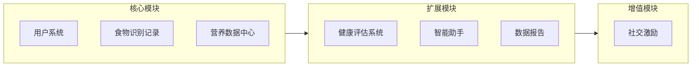
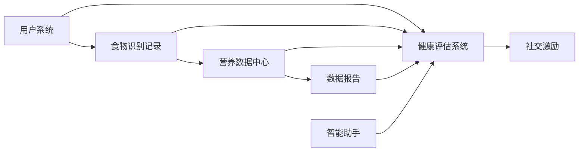

# 营养健康管家微信小程序需求文档 v4.0

## 1. 项目概述

### 1.1 项目背景
随着人们生活水平的提高，越来越多的人开始关注自身的营养健康状况。然而，大多数人缺乏专业的营养知识，难以科学地管理日常饮食。同时，超市购买的包装食品种类繁多，消费者难以快速判断其健康程度。为了帮助用户更好地了解自己的营养摄入情况，科学调整饮食结构，并快速识别包装食品的健康程度，我们计划开发一款营养健康管家微信小程序。

### 1.2 项目目标
开发一款功能完善、用户友好的微信小程序，实现以下核心目标：
1. 帮助用户记录日常饮食，监控营养摄入，提供专业的营养建议
2. 通过拍照识别包装食品配料表，快速评估食品健康程度
3. 针对特定人群（减脂、增肌、健康管理）提供个性化营养指导
4. 促进用户养成健康的饮食习惯

### 1.3 目标用户
- 关注健康饮食的普通用户
- 减脂人群：需要控制热量摄入、选择低卡食品的用户
- 增肌人群：需要高蛋白饮食、优化营养配比的用户
- 健康管理人群：有特定健康需求（如糖尿病、高血压）的用户
- 需要进行营养管理的特定群体（如孕妇、老年人等）

---

## 2. 功能架构

### 2.1 功能模块总览



### 2.2 模块依赖关系



---

## 3. 核心功能模块

### 3.1 用户系统

#### 3.1.1 注册与登录
- 微信一键登录
- 获取用户基本信息授权

#### 3.1.2 个人信息管理
- 基本信息：性别、年龄、身高、体重
- 健康信息：工作强度、健康状况、过敏史
- 联系方式（可选）

#### 3.1.3 健康目标设置
- 目标类型选择：
  - 减脂：设置目标体重、减脂速度
  - 增肌：设置目标体重、训练强度
  - 健康管理：选择关注点（血糖、血压、过敏等）
  - 维持健康：保持当前状态
- 系统自动计算：
  - 基础代谢率（BMR）
  - 每日总消耗热量（TDEE）
  - 各营养素推荐摄入量

---

### 3.2 食物识别与记录（核心流程）

> **设计理念**：统一入口，一次识别，多种用途

#### 3.2.1 统一识别入口
用户可通过以下方式添加食物：

| 识别方式 | 适用场景 | 识别内容 |
|---------|---------|---------|
| 扫码识别 | 包装食品 | 条形码 → 食品信息、配料表、营养成分 |
| 拍照识别 | 包装食品 | 配料表图片 → 食品信息、健康评分 |
| 拍照识别 | 非包装食物 | 食物图片 → 食物名称、估算重量 |
| 手动搜索 | 所有食物 | 关键词搜索 → 食物数据库匹配 |
| 快捷选择 | 常用食物 | 历史/收藏 → 快速添加 |

#### 3.2.2 识别结果页（核心页面）

**页面结构**：
```
┌─────────────────────────────────────┐
│           食物识别结果                │
├─────────────────────────────────────┤
│  ┌─────────────────────────────────┐ │
│  │        食物名称 + 图片            │ │
│  │      健康评分（颜色编码）          │ │
│  └─────────────────────────────────┘ │
│                                     │
│  ┌─────────────────────────────────┐ │
│  │        营养成分详情               │ │
│  │    热量 | 蛋白质 | 脂肪 | 碳水     │ │
│  │    添加剂 | 钠 | 糖              │ │
│  └─────────────────────────────────┘ │
│                                     │
│  ┌─────────────────────────────────┐ │
│  │        针对您的建议              │ │
│  │  根据用户目标显示个性化建议      │ │
│  │  - 减脂：热量占比、饱腹感        │ │
│  │  - 增肌：蛋白质密度              │ │
│  │  - 健康管理：相关指标            │ │
│  └─────────────────────────────────┘ │
│                                     │
│  ┌─────────────────────────────────┐ │
│  │        更健康的选择（可选）       │ │
│  │      推荐替代产品                │ │
│  └─────────────────────────────────┘ │
│                                     │
│  [添加到今日记录]  [收藏]  [分享]     │
│                                     │
│          [咨询AI营养师]              │
└─────────────────────────────────────┘
```

**关键交互**：
1. 识别成功后，用户可调整份量/数量
2. 点击"添加到今日记录"，选择餐次（早餐/午餐/晚餐/加餐）
3. 系统自动更新今日营养数据

#### 3.2.3 饮食记录管理
- 今日记录：按餐次展示已添加食物
- 历史记录：按日期查看过往记录
- 记录操作：编辑份量、删除记录、复制到今日

---

### 3.3 营养数据中心

> **设计理念**：整合监控，一目了然

#### 3.3.1 今日概览（首页核心）

**页面结构**：
```
┌─────────────────────────────────────┐
│           今日营养概览               │
│          2024年3月28日              │
├─────────────────────────────────────┤
│                                     │
│  ┌─────────────────────────────────┐ │
│  │         热量进度环               │ │
│  │    已摄入 1200 / 1800 kcal      │ │
│  │         剩余 600 kcal            │ │
│  └─────────────────────────────────┘ │
│                                     │
│  ┌─────────────────────────────────┐ │
│  │        三大营养素进度            │ │
│  │    蛋白质 ████████░░ 80%        │ │
│  │    脂肪   ██████░░░░ 60%        │ │
│  │    碳水   ███████░░░ 70%        │ │
│  └─────────────────────────────────┘ │
│                                     │
│  ┌─────────────────────────────────┐ │
│  │        关注指标（根据目标）       │ │
│  │    减脂：糖 ████░░░░░░ 40%       │ │
│  │    增肌：蛋白 ████████░░ 80%     │ │
│  │    健康：钠 ███░░░░░░░ 30%       │ │
│  └─────────────────────────────────┘ │
│                                     │
│         [快捷添加食物]  [查看详情]    │
└─────────────────────────────────────┘
```

#### 3.3.2 营养详情页
- 完整营养素列表：蛋白质、脂肪、碳水、膳食纤维、维生素、矿物质
- 添加剂统计：盐、糖、油等
- 与推荐值对比

#### 3.3.3 统一提醒中心
整合所有监控提醒：

| 提醒类型 | 触发条件 | 提醒内容 |
|---------|---------|---------|
| 热量提醒 | 摄入<80%或>110%目标 | 热量不足/超标提醒 |
| 营养素提醒 | 某营养素<70%或>120% | 营养素不足/超标提醒 |
| 添加剂提醒 | 添加剂超标 | 添加剂摄入超标提醒 |
| 饮食规律提醒 | 长时间未进食 | 提醒按时用餐 |

---

## 4. 扩展功能模块

### 4.1 健康评估系统

#### 4.1.1 包装食品健康评分
- 评分维度：
  - 配料表成分（天然成分占比）
  - 营养成分比例（是否符合健康标准）
  - 添加剂种类和数量
  - 加工程度（NOVA分类）
- 评分输出：0-10分 + 颜色编码
  - 绿色（8-10分）：优秀，推荐食用
  - 黄色（6-7分）：良好，适量食用
  - 橙色（4-5分）：一般，谨慎食用
  - 红色（0-3分）：较差，不建议食用

#### 4.1.2 特定人群评估
根据用户健康目标，提供专属评估维度：

| 目标人群 | 专属评估指标 | 建议策略 |
|---------|-------------|---------|
| 减脂人群 | 热量密度、饱腹感指数、减脂友好度 | 低卡替代推荐 |
| 增肌人群 | 蛋白质密度、营养配比、训练时机 | 高蛋白食物推荐 |
| 糖尿病人群 | 血糖指数、糖分含量 | 低GI食物推荐 |
| 高血压人群 | 钠含量 | 低钠替代推荐 |
| 过敏人群 | 过敏原识别 | 过敏风险提示 |

#### 4.1.3 替代推荐
- 当食品评分较低时，自动推荐更健康的替代品
- 推荐逻辑：同类食品、更高评分、符合用户目标

---

### 4.2 智能助手（AI营养师）

> **设计理念**：统一的智能建议入口

#### 4.2.1 功能定位
AI营养师是用户获取个性化建议的**唯一入口**，整合以下功能：
- 智能问答：解答营养相关问题
- 个性化建议：根据用户数据生成建议
- 饮食规划：生成个性化饮食计划
- 营养缺口分析：分析并补充建议

#### 4.2.2 交互方式
- 文字输入：支持自然语言对话
- 语音输入：语音转文字
- 快捷问题：预设常见问题快捷入口

#### 4.2.3 上下文感知
AI营养师可感知用户：
- 当前健康目标
- 今日/本周营养数据
- 最近识别的食物
- 历史饮食记录

---

### 4.3 数据报告

#### 4.3.1 日报
- 生成时机：每日晚间自动生成
- 报告内容：
  - 今日热量、营养素摄入总结
  - 与目标对比
  - 健康评分
  - 改进建议

#### 4.3.2 周报
- 生成时机：每周一自动生成上周报告
- 报告内容：
  - 本周营养摄入趋势图
  - 平均健康评分
  - 目标达成率
  - 下周建议

#### 4.3.3 趋势分析
- 长期数据可视化
- 营养摄入趋势
- 健康评分趋势
- 目标进度

#### 4.3.4 分享功能
- 支持分享日报/周报到微信好友/朋友圈
- 生成精美分享图片

---

## 5. 增值功能模块

### 5.1 社交激励

#### 5.1.1 健康打卡
- 打卡类型：
  - 每日记录打卡：完成当日饮食记录
  - 健康选择打卡：选择健康评分>6分的食品
  - 目标达成打卡：达成当日营养目标
- 打卡奖励：连续打卡获得成就徽章

#### 5.1.2 成就系统
- 成就类型：
  - 记录达人：累计记录天数
  - 健康先锋：选择健康食品次数
  - 目标达成者：达成目标次数
  - 探索家：识别不同种类食品数量

#### 5.1.3 好友互动
- 添加好友
- 查看好友健康评分排行
- 分享健康发现

---

## 6. 用户界面设计

### 6.1 页面结构

```
底部导航栏（4个Tab）：

┌─────────────────────────────────────────────────────────┐
│                                                         │
│                      页面内容区                          │
│                                                         │
├─────────────────────────────────────────────────────────┤
│   📊首页    │   📷识别    │   📋记录    │   👤我的     │
│   今日概览   │   快捷入口   │   历史记录   │   个人中心   │
└─────────────────────────────────────────────────────────┘
```

### 6.2 页面详情

| 页面 | 主要功能 | 核心元素 |
|-----|---------|---------|
| 首页 | 今日概览 | 热量进度、营养进度、快捷添加、提醒入口 |
| 识别 | 统一入口 | 扫码、拍照、搜索、快捷选择 |
| 记录 | 历史管理 | 今日记录、历史记录、收藏夹 |
| 我的 | 个人中心 | 个人信息、目标设置、报告、设置 |

### 6.3 设计风格
- 整体风格：简洁、现代、健康
- 主色调：绿色系（#4CAF50）代表健康、活力
- 辅助色：蓝色（#2196F3）代表专业、科技
- 图标风格：扁平化、简约

---

## 7. 技术架构

### 7.1 前端技术
- 微信小程序原生开发
- WXML、WXSS、JavaScript/TypeScript
- 第三方UI组件库（Vant Weapp）
- 图表库（ECharts for Weapp）

### 7.2 后端技术
- 微信云开发
- 云函数（Node.js）
- 云数据库
- 云存储

### 7.3 AI技术
- OCR识别：配料表文字识别
- 图像识别：食物识别
- 大语言模型：AI营养师

### 7.4 数据安全
- 数据加密存储
- 访问权限控制
- 定期数据备份

---

## 8. 数据需求

### 8.1 用户数据
```
用户表 (users)
├── 基本信息
│   ├── openid: 微信唯一标识
│   ├── nickname: 昵称
│   ├── avatar: 头像
│   ├── gender: 性别
│   ├── age: 年龄
│   ├── height: 身高(cm)
│   └── weight: 体重(kg)
├── 健康信息
│   ├── activity_level: 活动强度
│   ├── health_conditions: 健康状况[]
│   └── allergies: 过敏史[]
├── 目标设置
│   ├── goal_type: 目标类型(减脂/增肌/健康/维持)
│   ├── target_weight: 目标体重
│   ├── daily_calorie_goal: 每日热量目标
│   └── nutrition_goals: 营养素目标{}
└── 计算数据
    ├── bmr: 基础代谢率
    └── tdee: 每日总消耗
```

### 8.2 食物数据
```
食物表 (foods)
├── 基本信息
│   ├── name: 食物名称
│   ├── category: 分类
│   ├── image: 图片URL
│   └── barcode: 条形码(包装食品)
├── 营养成分(每100g)
│   ├── calories: 热量(kcal)
│   ├── protein: 蛋白质(g)
│   ├── fat: 脂肪(g)
│   ├── carbs: 碳水化合物(g)
│   ├── fiber: 膳食纤维(g)
│   ├── vitamins: 维生素{}
│   └── minerals: 矿物质{}
├── 添加剂信息
│   ├── sodium: 钠(mg)
│   ├── sugar: 糖(g)
│   └── additives: 添加剂列表[]
├── 配料信息(包装食品)
│   └── ingredients: 配料表
└── 评估数据
    ├── health_score: 健康评分
    ├── nova_class: NOVA分类
    └── glycemic_index: 血糖指数
```

### 8.3 记录数据
```
饮食记录表 (diet_records)
├── user_id: 用户ID
├── date: 日期
├── meal_type: 餐次(早餐/午餐/晚餐/加餐)
├── foods[]
│   ├── food_id: 食物ID
│   ├── amount: 份量(g)
│   └── nutrients: 营养素快照{}
└── created_at: 创建时间
```

---

## 9. 非功能需求

### 9.1 性能需求
- 页面加载时间 ≤ 3秒
- 数据处理响应时间 ≤ 1秒
- 支持同时在线用户数 ≥ 10000人
- 包装食品配料表识别准确率 ≥ 85%

### 9.2 可用性需求
- 界面友好，操作简单直观
- 支持离线查看历史数据
- 提供清晰的错误提示和操作引导
- AI营养师用户满意度 ≥ 80%

### 9.3 安全性需求
- 保护用户个人信息和健康数据
- 数据传输使用HTTPS加密
- 遵循微信小程序安全规范
- 用户数据加密存储
- 获取相机/相册权限前明确告知

### 9.4 兼容性需求
- 支持微信小程序最新版本
- 适配不同尺寸移动设备屏幕

---

## 10. 项目计划

### 10.1 开发阶段
| 阶段 | 内容 | 周期 |
|-----|------|-----|
| 需求分析与设计 | 需求确认、原型设计、技术方案 | 1周 |
| 前端开发 | 页面开发、组件封装、交互实现 | 3周 |
| 后端开发 | 云函数、数据库、接口开发 | 2周 |
| AI功能开发 | OCR识别、AI营养师集成 | 2周 |
| 测试与调试 | 功能测试、性能优化、Bug修复 | 1周 |
| 上线与运营 | 提交审核、上线部署、运营推广 | 1周 |

### 10.2 里程碑
- 第1周末：完成需求文档和原型设计
- 第2周末：完成前端框架搭建
- 第5周末：完成核心功能开发
- 第9周末：完成测试
- 第10周末：正式上线

---

## 11. 风险分析

### 11.1 潜在风险
| 风险 | 影响 | 概率 |
|-----|-----|-----|
| 食物数据库不完善 | 营养计算不准确 | 中 |
| 配料表识别准确率不达标 | 用户体验差 | 中 |
| AI营养师回答质量不稳定 | 用户信任度降低 | 中 |
| 小程序审核不通过 | 上线延迟 | 低 |

### 11.2 应对措施
- 建立完善的食物营养数据库，定期更新
- 优化OCR识别算法，提高配料表识别准确率
- 持续优化AI模型，建立人工审核机制
- 严格按照微信小程序审核规范开发

---

## 12. 验收标准

### 12.1 功能验收
- 所有P0功能正常运行
- 数据计算准确
- 界面操作流畅
- 响应时间符合要求

### 12.2 性能验收
- 页面加载时间 ≤ 3秒
- 数据处理响应时间 ≤ 1秒
- 支持10000人同时在线
- 配料表识别准确率 ≥ 85%

### 12.3 用户体验验收
- 界面设计美观，操作简单直观
- AI营养师用户满意度 ≥ 80%
- 特定人群功能有效帮助用户达成目标

---

## 13. 需求优先级

### 13.1 P0（必须实现 - MVP）
- 用户系统：注册登录、个人信息、目标设置
- 食物识别记录：扫码、拍照、手动搜索、添加记录
- 营养数据中心：今日概览、热量/营养监控
- 健康评估：基础健康评分

### 13.2 P1（重要功能）
- 特定人群评估功能
- AI营养师基础问答
- 替代推荐
- 统一提醒中心

### 13.3 P2（次要功能）
- 数据报告：日报、周报
- 历史记录管理
- 收藏功能
- 趋势分析

### 13.4 P3（可选功能）
- 社交激励：打卡、成就、好友
- 分享功能
- 高级AI功能

---

## 14. 附录

### 14.1 术语定义
| 术语 | 定义 |
|-----|-----|
| BMR | 基础代谢率，人体在安静状态下维持生命所需的最低能量 |
| TDEE | 每日总消耗热量，包括基础代谢、运动消耗和食物热效应 |
| NOVA分类 | 根据食品加工程度对食品进行分类的系统 |
| 血糖指数(GI) | 衡量食物对血糖影响程度的指标 |

### 14.2 参考资料
- 《中国居民膳食指南》
- 《营养与食品卫生学》
- 微信小程序开发文档
- 相关营养数据库

---

## 15. 版本历史

| 版本 | 日期 | 变更内容 |
|-----|------|---------|
| v1.0 | - | 初始版本（需求文档2.0） |
| v2.0 | - | 新增包装食品识别功能（需求文档B-1.2） |
| v3.0 | - | 整合两个版本，功能合并 |
| v4.0 | 2024-03-28 | 重构功能架构，解决功能重叠，优化交互逻辑 |
