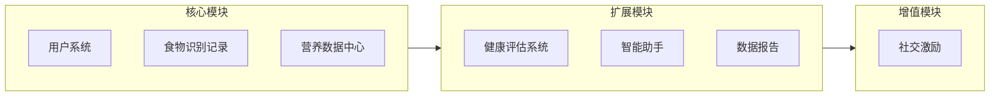
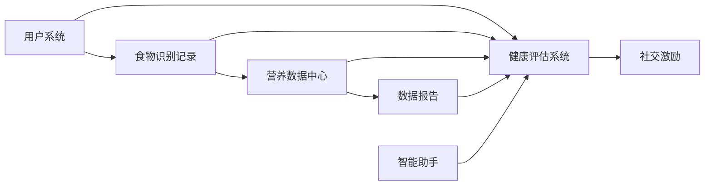

# 营养健康管家微信小程序需求文档 v5.0

## 文档说明

本版本基于世界卫生组织（WHO）、国家卫生健康委员会、中国营养学会、美国运动医学会（ACSM）、国际运动营养学会（ISSN）等权威机构发布的最新营养学、健康学及医学专业指南进行全面优化。所有核心功能模块均具备坚实的科学依据和专业指导价值。

***

## 1. 项目概述

### 1.1 项目背景

随着人们生活水平的提高，越来越多的人开始关注自身的营养健康状况。然而，大多数人缺乏专业的营养知识，难以科学地管理日常饮食。同时，超市购买的包装食品种类繁多，消费者难以快速判断其健康程度。为了帮助用户更好地了解自己的营养摄入情况，科学调整饮食结构，并快速识别包装食品的健康程度，我们计划开发一款营养健康管家微信小程序。

### 1.2 专业背景

> **说明**：本小节阐述项目开发的科学必要性和专业依据。

#### 1.2.1 营养健康问题的严峻性

依据世界卫生组织（WHO）和国家卫生健康委员会发布的权威数据：

| 健康问题 | 数据统计 | 来源 |
|---------|---------|------|
| 超重肥胖 | 中国成人超重率34.3%、肥胖率16.4% | 《中国居民营养与慢性病状况报告（2020）》 |
| 糖尿病 | 中国成人糖尿病患病率11.2% | 《中国糖尿病流行病学调查》 |
| 高血压 | 中国成人高血压患病率27.5% | 《中国高血压防治指南》 |
| 营养不良 | 微量营养素缺乏问题普遍存在 | WHO《全球营养报告》 |

#### 1.2.2 膳食营养的科学重要性

依据《中国居民膳食指南（2022）》和WHO《健康饮食》指南：

- **膳食与慢性病关系**：不健康饮食是心血管疾病、糖尿病、癌症等慢性病的主要风险因素
- **营养素平衡**：合理的营养素配比可降低慢性病风险15%-30%
- **食品选择能力**：消费者普遍缺乏识别健康食品的能力，需要专业工具辅助

#### 1.2.3 数字化健康管理的必要性

依据国家《"健康中国2030"规划纲要》：

- 推动健康信息服务和智慧医疗服务发展
- 利用移动互联网技术提供个性化健康管理服务
- 提高居民健康素养和自我管理能力

### 1.3 项目目标

开发一款功能完善、用户友好的微信小程序，实现以下核心目标：

1. 帮助用户记录日常饮食，监控营养摄入，提供专业的营养建议
2. 通过拍照识别包装食品配料表，快速评估食品健康程度
3. 针对特定人群（减脂、增肌、健康管理）提供个性化营养指导
4. 促进用户养成健康的饮食习惯

### 1.4 目标用户

- 关注健康饮食的普通用户
- 减脂人群：需要控制热量摄入、选择低卡食品的用户
- 增肌人群：需要高蛋白饮食、优化营养配比的用户
- 健康管理人群：有特定健康需求（如糖尿病、高血压）的用户
- 需要进行营养管理的特定群体（如孕妇、老年人等）

***

## 2. 专业依据与科学基础

> **说明**：本章节列出项目核心功能所依据的权威专业文献和标准，确保所有营养建议和健康评估均具备科学依据。

### 2.1 核心参考文献

| 文献名称                        | 发布机构        | 适用模块       |
| --------------------------- | ----------- | ---------- |
| 《中国居民膳食指南（2022）》            | 中国营养学会      | 膳食建议、营养目标  |
| 《中国居民膳食营养素参考摄入量（2013）》      | 中国营养学会      | 营养素推荐量     |
| 《成人糖尿病食养指南（2023年版）》         | 国家卫生健康委     | 糖尿病人群营养管理  |
| 《成人高血压食养指南（2023年版）》         | 国家卫生健康委     | 高血压人群营养管理  |
| 《中国糖尿病医学营养治疗指南（2013）》       | 中华医学会       | 糖尿病营养治疗    |
| WHO《健康饮食》指南                 | 世界卫生组织      | 膳食建议、营养素比例 |
| WHO《成人和儿童糖摄入量指南》            | 世界卫生组织      | 糖摄入控制      |
| WHO《成人和儿童钠摄入量指南》            | 世界卫生组织      | 钠摄入控制      |
| ACSM《营养与运动表现》立场声明           | 美国运动医学会     | 运动营养、能量需求  |
| ISSN《蛋白质与运动》立场声明            | 国际运动营养学会    | 蛋白质需求、增肌营养 |
| NOVA食品分类系统                  | 巴西圣保罗大学/FAO | 食品加工程度评估   |
| GB 2760《食品安全国家标准 食品添加剂使用标准》 | 国家卫生健康委     | 添加剂安全性评估   |
| GB 7718《预包装食品标签通则》          | 国家卫生健康委     | 过敏原标识      |

### 2.2 核心营养学标准

#### 2.2.1 能量需求计算标准

**基础代谢率（BMR）计算公式**

采用Mifflin-St Jeor公式（1990年发布，准确性比Harris-Benedict高约5%，被多数营养学会推荐使用）：

```
男性：BMR = (10 × 体重kg) + (6.25 × 身高cm) - (5 × 年龄) + 5
女性：BMR = (10 × 体重kg) + (6.25 × 身高cm) - (5 × 年龄) - 161
```

**每日总能量消耗（TDEE）计算**

TDEE = BMR × 活动系数

| 活动水平 | 活动系数  | 说明         |
| ---- | ----- | ---------- |
| 久坐不动 | 1.2   | 办公室工作，很少运动 |
| 轻度活动 | 1.375 | 每周运动1-3天   |
| 中度活动 | 1.55  | 每周运动3-5天   |
| 高度活动 | 1.725 | 每周运动6-7天   |
| 极度活动 | 1.9   | 每天运动或重体力劳动 |

**来源**：ACSM《营养与运动表现》立场声明

#### 2.2.2 体重评估标准

**BMI分类标准（中国成人）**

依据《中国成人超重和肥胖症预防控制指南》：

| 分类   | BMI (kg/m²) | 健康风险   |
| ---- | ----------- | ------ |
| 体重过低 | <18.5       | 营养不良风险 |
| 体重正常 | 18.5-23.9   | 低风险    |
| 超重   | 24.0-27.9   | 增加风险   |
| 肥胖   | ≥28.0       | 高风险    |

**说明**：亚洲人BMI标准与WHO国际标准不同，因亚洲人在较低BMI时即出现较高的代谢疾病风险。WHO西太平洋地区建议亚洲人超重标准为BMI≥23，肥胖标准为BMI≥25。

#### 2.2.3 营养素推荐摄入比例

**三大营养素供能比**

依据WHO《健康饮食》指南及《中国居民膳食指南（2022）》：

| 营养素   | 供能比例    | 说明      |
| ----- | ------- | ------- |
| 碳水化合物 | 50%-65% | 主要能量来源  |
| 蛋白质   | 10%-15% | 一般人群    |
| 脂肪    | 20%-30% | 成人上限30% |

**特殊人群蛋白质需求**

依据ISSN《蛋白质与运动》立场声明（2022）：

| 人群类型       | 蛋白质需求 (g/kg体重/天) | 来源   |
| ---------- | ---------------- | ---- |
| 一般成年人      | 0.8              | RDA  |
| 减脂人群       | 1.2-1.6          | ACSM |
| 增肌人群       | 1.4-2.0          | ISSN |
| 老年人（预防肌少症） | 1.2-1.5          | WHO  |

#### 2.2.4 限盐限糖标准

| 营养素 | 推荐限值           | 来源               |
| --- | -------------- | ---------------- |
| 食盐  | <5g/天          | 《中国居民膳食指南（2022）》 |
| 钠   | <2000mg/天      | WHO《钠摄入量指南》      |
| 添加糖 | <50g/天（最好<25g） | 《中国居民膳食指南（2022）》 |
| 游离糖 | <总能量10%（最好<5%） | WHO《糖摄入量指南》      |

***

## 3. 功能架构

### 3.1 功能模块总览



### 3.2 模块依赖关系



***

## 4. 核心功能模块

### 4.1 用户系统

#### 4.1.1 注册与登录

- 微信一键登录
- 获取用户基本信息授权

#### 4.1.2 个人信息管理

- 基本信息：性别、年龄、身高、体重
- 健康信息：工作强度、健康状况、过敏史
- 联系方式（可选）

#### 4.1.3 健康目标设置

**目标类型选择**：

| 目标类型 | 设置内容                   | 专业依据              |
| ---- | ---------------------- | ----------------- |
| 减脂   | 目标体重、减脂速度（建议0.5-1kg/周） | ACSM建议每周减重不超过1%体重 |
| 增肌   | 目标体重、训练强度              | ISSN蛋白质需求标准       |
| 健康管理 | 关注点（血糖、血压、过敏等）         | 国家卫健委食养指南         |
| 维持健康 | 保持当前状态                 | 《中国居民膳食指南》        |

**系统自动计算**：

基于Mifflin-St Jeor公式和活动系数计算：

| 计算项目          | 计算方法                                | 专业依据       |
| ------------- | ----------------------------------- | ---------- |
| 基础代谢率（BMR）    | Mifflin-St Jeor公式                   | ACSM推荐     |
| 每日总消耗热量（TDEE） | BMR × 活动系数                          | ACSM标准     |
| 目标热量          | 减脂：TDEE-300\~500kcal增肌：TDEE+300kcal | ACSM体重管理指南 |
| 蛋白质目标         | 减脂：1.2-1.6g/kg增肌：1.4-2.0g/kg        | ISSN立场声明   |
| 碳水化合物目标       | 占总能量50%-65%                         | 《中国居民膳食指南》 |
| 脂肪目标          | 占总能量20%-30%                         | WHO健康饮食指南  |

***

### 4.2 食物识别与记录（核心流程）

> **设计理念**：统一入口，一次识别，多种用途

#### 4.2.1 统一识别入口

用户可通过以下方式添加食物：

| 识别方式 | 适用场景  | 识别内容                     |
| ---- | ----- | ------------------------ |
| 扫码识别 | 包装食品  | 条形码 → 食品信息、配料表、营养成分      |
| 拍照识别 | 包装食品  | 配料表图片 → 食品信息、配料表、营养成分    |
| 拍照识别 | 非包装食物 | 食物图片 → 食物名称、估算营养成分、热量、重量 |
| 手动搜索 | 所有食物  | 关键词搜索 → 食物数据库匹配          |
| 快捷选择 | 常用食物  | 历史/收藏 → 快速添加             |

#### 4.2.2 识别结果页（核心页面）

**页面结构**：

```
┌─────────────────────────────────────┐
│           食物识别结果                │
├─────────────────────────────────────┤
│  ┌─────────────────────────────────┐ │
│  │        食物名称 + 图片            │ │
│  │      健康评分（颜色编码）          │ │
│  └─────────────────────────────────┘ │
│                                     │
│  ┌─────────────────────────────────┐ │
│  │        营养成分详情               │ │
│  │    热量 | 蛋白质 | 脂肪 | 碳水     │ │
│  │    添加剂 | 钠 | 糖              │ │
│  └─────────────────────────────────┘ │
│                                     │
│  ┌─────────────────────────────────┐ │
│  │        针对您的建议              │ │
│  │  根据用户目标显示个性化建议      │ │
│  │  - 减脂：热量占比、饱腹感        │ │
│  │  - 增肌：蛋白质密度              │ │
│  │  - 健康管理：相关指标            │ │
│  └─────────────────────────────────┘ │
│                                     │
│  ┌─────────────────────────────────┐ │
│  │        更健康的选择（可选）       │ │
│  │      推荐替代产品                │ │
│  └─────────────────────────────────┘ │
│                                     │
│  [添加到今日记录]  [收藏]  [分享]     │
│                                     │
│          [咨询AI营养师]              │
└─────────────────────────────────────┘
```

**关键交互**：

1. 识别成功后，用户可调整份量/数量
2. 点击"添加到今日记录"，选择餐次（早餐/午餐/晚餐/加餐）
3. 系统自动更新今日营养数据

#### 4.2.3 饮食记录管理

- 今日记录：按餐次展示已添加食物
- 历史记录：按日期查看过往记录
- 记录操作：编辑份量、删除记录、复制到今日

***

### 4.3 营养数据中心

> **设计理念**：整合监控，一目了然

#### 4.3.1 今日概览（首页核心）

**页面结构**：

```
┌─────────────────────────────────────┐
│           今日营养概览               │
│          2024年3月28日              │
├─────────────────────────────────────┤
│                                     │
│  ┌─────────────────────────────────┐ │
│  │         热量进度环               │ │
│  │    已摄入 1200 / 1800 kcal      │ │
│  │         剩余 600 kcal            │ │
│  └─────────────────────────────────┘ │
│                                     │
│  ┌─────────────────────────────────┐ │
│  │        三大营养素进度            │ │
│  │    蛋白质 ████████░░ 80%        │ │
│  │    脂肪   ██████░░░░ 60%        │ │
│  │    碳水   ███████░░░ 70%        │ │
│  └─────────────────────────────────┘ │
│                                     │
│  ┌─────────────────────────────────┐ │
│  │        关注指标（根据目标）       │ │
│  │    减脂：糖 ████░░░░░░ 40%       │ │
│  │    增肌：蛋白 ████████░░ 80%     │ │
│  │    健康：钠 ███░░░░░░░ 30%       │ │
│  └─────────────────────────────────┘ │
│                                     │
│         [快捷添加食物]  [查看详情]    │
└─────────────────────────────────────┘
```

#### 4.3.2 营养详情页

- 完整营养素列表：蛋白质、脂肪、碳水、膳食纤维、维生素、矿物质
- 添加剂统计：盐、糖、油等
- 与推荐值对比

#### 4.3.3 统一提醒中心

整合所有监控提醒：

| 提醒类型   | 触发条件           | 提醒内容       | 专业依据       |
| ------ | -------------- | ---------- | ---------- |
| 热量提醒   | 摄入<80%或>110%目标 | 热量不足/超标提醒  | ACSM体重管理   |
| 营养素提醒  | 某营养素<70%或>120% | 营养素不足/超标提醒 | DRIs标准     |
| 添加剂提醒  | 添加剂超标          | 添加剂摄入超标提醒  | GB2760标准   |
| 饮食规律提醒 | 长时间未进食         | 提醒按时用餐     | 《中国居民膳食指南》 |
| 钠摄入提醒  | 钠摄入>2000mg     | 钠摄入超标提醒    | WHO钠摄入指南   |
| 糖摄入提醒  | 添加糖>50g        | 糖摄入超标提醒    | WHO糖摄入指南   |

***

## 5. 扩展功能模块

### 5.1 健康评估系统

#### 5.1.1 包装食品健康评分

**评分维度与权重**：

| 评分维度   | 权重  | 评估内容         | 专业依据       |
| ------ | --- | ------------ | ---------- |
| 营养成分比例 | 30% | 三大营养素配比是否合理  | 《中国居民膳食指南》 |
| 添加剂评估  | 25% | 添加剂种类、数量、安全性 | GB2760标准   |
| 加工程度   | 20% | NOVA分类等级     | FAO/NOVA系统 |
| 钠含量    | 15% | 钠含量是否超标      | WHO钠摄入指南   |
| 糖含量    | 10% | 添加糖含量        | WHO糖摄入指南   |

**评分输出**：0-10分 + 颜色编码

| 分数区间  | 颜色 | 评价 | 建议    |
| ----- | -- | -- | ----- |
| 8-10分 | 绿色 | 优秀 | 推荐食用  |
| 6-7分  | 黄色 | 良好 | 适量食用  |
| 4-5分  | 橙色 | 一般 | 谨慎食用  |
| 0-3分  | 红色 | 较差 | 不建议食用 |

#### 5.1.2 NOVA食品分类评估

依据FAO认可的NOVA分类系统：

| 分类  | 定义         | 示例                | 健康建议 |
| --- | ---------- | ----------------- | ---- |
| 第一类 | 未加工或最低加工食品 | 新鲜水果、蔬菜、鲜奶、鸡蛋、全谷物 | 推荐为主 |
| 第二类 | 加工烹饪原料     | 植物油、盐、糖、蜂蜜        | 适量使用 |
| 第三类 | 加工食品       | 罐头蔬菜、芝士、烟熏鱼       | 适量食用 |
| 第四类 | 超加工食品      | 汽水、零食、即食面、加工肉制品   | 尽量避免 |

**识别方法**：

- 配料表中含有5种以上成分
- 含有家庭厨房不常用的成分（如高果糖玉米糖浆、氢化油、人工香精等）
- 含有多种食品添加剂

#### 5.1.3 特定人群评估

根据用户健康目标，提供专属评估维度：

##### 5.1.3.1 减脂人群评估

**专业依据**：ACSM《成人减重和防止体重反弹的体力活动干预策略》

| 评估指标  | 计算方法         | 建议范围          | 说明           |
| ----- | ------------ | ------------- | ------------ |
| 热量密度  | kcal/100g    | <150kcal/100g | 低热量密度食物更利于减脂 |
| 蛋白质密度 | g蛋白质/100kcal | >8g/100kcal   | 高蛋白密度有助于保持肌肉 |
| 饱腹感指数 | 综合评估         | 高纤维、高蛋白       | 延长饱腹感，减少进食   |
| 减脂友好度 | 综合评分         | 0-10分         | 综合热量、营养素、饱腹感 |

**热量缺口建议**：

- 每日热量缺口：300-500kcal（来源：ACSM）
- 每周减重速度：0.5-1kg（不超过体重的1%）

##### 5.1.3.2 增肌人群评估

**专业依据**：ISSN《蛋白质与运动》立场声明（2022）

| 评估指标  | 计算方法    | 建议范围      | 说明         |
| ----- | ------- | --------- | ---------- |
| 蛋白质含量 | g/100g  | >20g/100g | 高蛋白食物优先    |
| 蛋白质质量 | 生物价(BV) | BV>80     | 优质蛋白更利于合成  |
| 亮氨酸含量 | mg/份    | >2000mg   | 亮氨酸是肌肉合成关键 |
| 训练时机  | 距训练时间   | 训练前后2小时内  | 最佳合成窗口     |

**蛋白质摄入建议**：

- 每日蛋白质：1.4-2.0g/kg体重（ISSN标准）
- 每份蛋白质：20-40g优质蛋白
- 摄入频率：每3-4小时一次
- 睡前补充：酪蛋白30-40g

##### 5.1.3.3 糖尿病人群评估

**专业依据**：《成人糖尿病食养指南（2023年版）》

| 评估指标       | 分类标准                    | 说明          |
| ---------- | ----------------------- | ----------- |
| 血糖生成指数(GI) | 低GI≤55，中GI 56-70，高GI>70 | 选择低GI食物     |
| 血糖负荷(GL)   | 低GL≤10，中GL 11-19，高GL≥20 | 控制每餐GL      |
| 碳水化合物总量    | 200-300g/天              | 占总能量45%-60% |
| 膳食纤维       | ≥25g/天                  | 延缓糖吸收       |

**食物GI分类表**：

| GI分类       | 食物示例              |
| ---------- | ----------------- |
| 低GI(≤55)   | 燕麦、糙米、豆类、大多数水果、牛奶 |
| 中GI(56-70) | 糙米饭、全麦面包、小米粥      |
| 高GI(>70)   | 白米饭、白面包、土豆泥、西瓜    |

**碳水化合物计数法**：

- 适用于1型糖尿病和胰岛素治疗的2型糖尿病患者
- 帮助计算餐前胰岛素用量
- 提高血糖控制精确度

##### 5.1.3.4 高血压人群评估

**专业依据**：《成人高血压食养指南（2023年版）》

| 评估指标   | 标准        | 说明           |
| ------ | --------- | ------------ |
| 钠含量    | <2000mg/天 | 相当于食盐<5g     |
| 钾含量    | ≥3600mg/天 | 钾有助于降压       |
| DASH评分 | 0-10分     | 评估是否符合DASH饮食 |

**DASH饮食原则**：

- 增加蔬菜水果摄入
- 选择低脂乳制品
- 限制红肉和加工肉类
- 减少饱和脂肪和添加糖
- 选择全谷物

**推荐食物**：

- 富钾蔬菜：菠菜、芥兰、莴笋叶、空心菜、苋菜、口蘑
- 低钠食品：钠含量<300mg/份

##### 5.1.3.5 过敏人群评估

**专业依据**：GB 7718《预包装食品标签通则》

**八大过敏原识别**：

| 序号 | 过敏原类别 | 常见食物         |
| -- | ----- | ------------ |
| 1  | 含麸质谷物 | 小麦、黑麦、大麦、燕麦  |
| 2  | 甲壳类动物 | 虾、蟹、龙虾       |
| 3  | 鱼类    | 各种鱼类         |
| 4  | 蛋类    | 鸡蛋、鸭蛋等       |
| 5  | 花生    | 花生及制品        |
| 6  | 大豆    | 大豆及制品        |
| 7  | 乳制品   | 牛奶、奶粉、奶酪等    |
| 8  | 坚果    | 杏仁、腰果、核桃、榛子等 |

**过敏原风险提示**：

- 直接含有：配料表中明确含有过敏原成分
- 可能含有：生产线交叉污染风险提示

#### 5.1.4 替代推荐

- 当食品评分较低时，自动推荐更健康的替代品
- 推荐逻辑：同类食品、更高评分、符合用户目标
- 考虑用户过敏史，排除过敏原食品

***

### 5.2 智能助手（AI营养师）

> **设计理念**：统一的智能建议入口

#### 5.2.1 功能定位

AI营养师是用户获取个性化建议的**唯一入口**，整合以下功能：

- 智能问答：解答营养相关问题
- 个性化建议：根据用户数据生成建议
- 饮食规划：生成个性化饮食计划
- 营养缺口分析：分析并补充建议

#### 5.2.2 交互方式

- 文字输入：支持自然语言对话
- 语音输入：语音转文字
- 快捷问题：预设常见问题快捷入口

#### 5.2.3 上下文感知

AI营养师可感知用户：

- 当前健康目标
- 今日/本周营养数据
- 最近识别的食物
- 历史饮食记录

#### 5.2.4 专业知识库

AI营养师应基于以下专业知识库进行回答：

| 知识库类型 | 内容来源          | 更新频率  |
| ----- | ------------- | ----- |
| 膳食指南  | 《中国居民膳食指南》    | 每5年更新 |
| 营养素标准 | DRIs、WHO指南    | 定期更新  |
| 疾病营养  | 国家卫健委食养指南     | 按需更新  |
| 运动营养  | ACSM、ISSN立场声明 | 定期更新  |
| 食品安全  | GB标准、食品安全法规   | 按需更新  |

***

### 5.3 数据报告

#### 5.3.1 日报

- 生成时机：每日晚间自动生成
- 报告内容：
  - 今日热量、营养素摄入总结
  - 与目标对比
  - 健康评分
  - 改进建议

#### 5.3.2 周报

- 生成时机：每周一自动生成上周报告
- 报告内容：
  - 本周营养摄入趋势图
  - 平均健康评分
  - 目标达成率
  - 下周建议

#### 5.3.3 趋势分析

- 长期数据可视化
- 营养摄入趋势
- 健康评分趋势
- 目标进度

#### 5.3.4 分享功能

- 支持分享日报/周报到微信好友/朋友圈
- 生成精美分享图片

***

## 6. 增值功能模块

### 6.1 社交激励

#### 6.1.1 健康打卡

- 打卡类型：
  - 每日记录打卡：完成当日饮食记录
  - 健康选择打卡：选择健康评分>6分的食品
  - 目标达成打卡：达成当日营养目标
- 打卡奖励：连续打卡获得成就徽章

#### 6.1.2 成就系统

- 成就类型：
  - 记录达人：累计记录天数
  - 健康先锋：选择健康食品次数
  - 目标达成者：达成目标次数
  - 探索家：识别不同种类食品数量

#### 6.1.3 好友互动

- 添加好友
- 查看好友健康评分排行
- 分享健康发现

***

## 7. 用户界面设计

### 7.1 页面结构

```
底部导航栏（4个Tab）：

┌─────────────────────────────────────────────────────────┐
│                                                         │
│                      页面内容区                          │
│                                                         │
├─────────────────────────────────────────────────────────┤
│   📊首页    │   📷识别    │   📋记录    │   👤我的     │
│   今日概览   │   快捷入口   │   历史记录   │   个人中心   │
└─────────────────────────────────────────────────────────┘
```

### 7.2 页面详情

| 页面 | 主要功能 | 核心元素                |
| -- | ---- | ------------------- |
| 首页 | 今日概览 | 热量进度、营养进度、快捷添加、提醒入口 |
| 识别 | 统一入口 | 扫码、拍照、搜索、快捷选择       |
| 记录 | 历史管理 | 今日记录、历史记录、收藏夹       |
| 我的 | 个人中心 | 个人信息、目标设置、报告、设置     |

### 7.3 设计风格

- 整体风格：简洁、现代、健康
- 主色调：绿色系（#4CAF50）代表健康、活力
- 辅助色：蓝色（#2196F3）代表专业、科技
- 图标风格：扁平化、简约

***

## 8. 技术架构

### 8.1 前端技术

- 微信小程序原生开发
- WXML、WXSS、JavaScript/TypeScript
- 第三方UI组件库（Vant Weapp）
- 图表库（ECharts for Weapp）

### 8.2 后端技术

- 微信云开发
- 云函数（Node.js）
- 云数据库
- 云存储

### 8.3 AI技术

- OCR识别：配料表文字识别
- 图像识别：食物识别
- 大语言模型：AI营养师

### 8.4 数据安全

- 数据加密存储
- 访问权限控制
- 定期数据备份

***

## 9. 数据需求

### 9.1 用户数据

```
用户表 (users)
├── 基本信息
│   ├── openid: 微信唯一标识
│   ├── nickname: 昵称
│   ├── avatar: 头像
│   ├── gender: 性别
│   ├── age: 年龄
│   ├── height: 身高(cm)
│   └── weight: 体重(kg)
├── 健康信息
│   ├── activity_level: 活动强度(久坐/轻度/中度/高度/极度)
│   ├── health_conditions: 健康状况[]（糖尿病/高血压/高血脂等）
│   └── allergies: 过敏史[]（八大过敏原）
├── 目标设置
│   ├── goal_type: 目标类型(减脂/增肌/健康/维持)
│   ├── target_weight: 目标体重
│   ├── weekly_target: 每周目标(减脂:0.5-1kg)
│   ├── daily_calorie_goal: 每日热量目标
│   └── nutrition_goals: 营养素目标{}
└── 计算数据
    ├── bmr: 基础代谢率(Mifflin-St Jeor公式)
    ├── tdee: 每日总消耗
    ├── bmi: 体质指数
    └── bmi_category: BMI分类
```

### 9.2 食物数据

```
食物表 (foods)
├── 基本信息
│   ├── name: 食物名称
│   ├── category: 分类
│   ├── image: 图片URL
│   └── barcode: 条形码(包装食品)
├── 营养成分(每100g)
│   ├── calories: 热量(kcal)
│   ├── protein: 蛋白质(g)
│   ├── fat: 脂肪(g)
│   ├── saturated_fat: 饱和脂肪(g)
│   ├── carbs: 碳水化合物(g)
│   ├── fiber: 膳食纤维(g)
│   ├── sugar: 糖(g)
│   ├── sodium: 钠(mg)
│   ├── potassium: 钾(mg)
│   ├── vitamins: 维生素{}
│   └── minerals: 矿物质{}
├── 添加剂信息
│   ├── additives: 添加剂列表[]
│   └── additive_count: 添加剂数量
├── 配料信息(包装食品)
│   ├── ingredients: 配料表
│   └── allergens: 过敏原[]
├── 评估数据
│   ├── health_score: 健康评分(0-10)
│   ├── nova_class: NOVA分类(1-4)
│   ├── glycemic_index: 血糖指数(GI)
│   ├── glycemic_load: 血糖负荷(GL)
│   └── protein_quality: 蛋白质质量(BV)
└── 特定人群评分
    ├── weight_loss_score: 减脂友好度
    ├── muscle_gain_score: 增肌友好度
    ├── diabetes_score: 糖尿病友好度
    └── hypertension_score: 高血压友好度
```

### 9.3 记录数据

```
饮食记录表 (diet_records)
├── user_id: 用户ID
├── date: 日期
├── meal_type: 餐次(早餐/午餐/晚餐/加餐)
├── foods[]
│   ├── food_id: 食物ID
│   ├── amount: 份量(g)
│   └── nutrients: 营养素快照{}
└── created_at: 创建时间
```

***

## 10. 非功能需求

### 10.1 性能需求

- 页面加载时间 ≤ 3秒
- 数据处理响应时间 ≤ 1秒
- 支持同时在线用户数 ≥ 10000人
- 包装食品配料表识别准确率 ≥ 85%

### 10.2 专业准确性需求

> **说明**：本小节定义系统在营养计算、健康评估等方面的专业准确性要求，确保输出结果符合权威标准。

#### 10.2.1 能量计算准确性

| 计算项目 | 准确性要求 | 验证方法 | 专业依据 |
|---------|-----------|---------|---------|
| BMR计算 | 误差 ≤ 5% | 与间接量热法对比 | Mifflin-St Jeor公式标准误差 |
| TDEE计算 | 误差 ≤ 10% | 与双标水法对比 | ACSM活动系数标准 |
| 热量累加 | 误差 ≤ 2% | 单元测试验证 | 营养数据库标准 |

#### 10.2.2 营养素计算准确性

| 营养素 | 准确性要求 | 说明 | 专业依据 |
|-------|-----------|------|---------|
| 三大营养素 | 误差 ≤ 5% | 蛋白质、脂肪、碳水化合物 | USDA食物数据库标准 |
| 微量营养素 | 误差 ≤ 10% | 维生素、矿物质 | DRIs标准 |
| GI/GL计算 | 误差 ≤ 10% | 血糖指数、血糖负荷 | 《成人糖尿病食养指南》 |

#### 10.2.3 健康评估准确性

| 评估项目 | 准确性要求 | 验证方法 | 专业依据 |
|---------|-----------|---------|---------|
| 食品健康评分 | 与专家评分一致性 ≥ 80% | 专家评审对比 | NOVA分类、GB2760标准 |
| NOVA分类 | 准确率 ≥ 85% | 人工标注对比 | FAO NOVA分类系统 |
| 过敏原识别 | 准确率 ≥ 95% | 配料表人工核对 | GB 7718标准 |
| 特定人群评估 | 与营养师建议一致性 ≥ 75% | 专业营养师评审 | 国家卫健委食养指南 |

#### 10.2.4 数据来源可靠性

| 数据类型 | 数据来源 | 更新频率 | 可靠性要求 |
|---------|---------|---------|-----------|
| 食物营养数据 | USDA、中国食物成分表 | 每年更新 | 官方权威来源 |
| GI值数据 | 《中国食物成分表》、国际GI数据库 | 定期更新 | 同行评审文献 |
| 添加剂数据 | GB 2760标准 | 按国标更新 | 国家标准 |
| 膳食建议 | 《中国居民膳食指南》 | 每5年更新 | 国家权威指南 |

### 10.3 可用性需求

- 界面友好，操作简单直观
- 支持离线查看历史数据
- 提供清晰的错误提示和操作引导
- AI营养师用户满意度 ≥ 80%

### 10.4 安全性需求

- 保护用户个人信息和健康数据
- 数据传输使用HTTPS加密
- 遵循微信小程序安全规范
- 用户数据加密存储
- 获取相机/相册权限前明确告知

### 10.5 兼容性需求

- 支持微信小程序最新版本
- 适配不同尺寸移动设备屏幕

***

## 11. 项目计划

### 11.1 开发阶段

| 阶段      | 内容              | 周期 |
| ------- | --------------- | -- |
| 需求分析与设计 | 需求确认、原型设计、技术方案  | 1周 |
| 前端开发    | 页面开发、组件封装、交互实现  | 3周 |
| 后端开发    | 云函数、数据库、接口开发    | 2周 |
| AI功能开发  | OCR识别、AI营养师集成   | 2周 |
| 测试与调试   | 功能测试、性能优化、Bug修复 | 1周 |
| 上线与运营   | 提交审核、上线部署、运营推广  | 1周 |

### 11.2 里程碑

- 第1周末：完成需求文档和原型设计
- 第2周末：完成前端框架搭建
- 第5周末：完成核心功能开发
- 第9周末：完成测试
- 第10周末：正式上线

***

## 12. 风险分析

### 12.1 潜在风险

| 风险           | 影响      | 概率 |
| ------------ | ------- | -- |
| 食物数据库不完善     | 营养计算不准确 | 中  |
| 配料表识别准确率不达标  | 用户体验差   | 中  |
| AI营养师回答质量不稳定 | 用户信任度降低 | 中  |
| 小程序审核不通过     | 上线延迟    | 低  |

### 12.2 应对措施

- 建立完善的食物营养数据库，定期更新
- 优化OCR识别算法，提高配料表识别准确率
- 持续优化AI模型，建立人工审核机制
- 严格按照微信小程序审核规范开发

***

## 13. 验收标准

### 13.1 功能验收

- 所有P0功能正常运行
- 数据计算准确
- 界面操作流畅
- 响应时间符合要求

### 13.2 性能验收

- 页面加载时间 ≤ 3秒
- 数据处理响应时间 ≤ 1秒
- 支持10000人同时在线
- 配料表识别准确率 ≥ 85%

### 13.3 专业准确性验收

> **说明**：本小节定义系统在专业准确性方面的验收标准，确保输出结果符合权威营养学标准。

#### 13.3.1 能量计算验收标准

| 验收项目 | 验收标准 | 测试方法 | 合格判定 |
|---------|---------|---------|---------|
| BMR计算 | 与Mifflin-St Jeor公式计算结果误差 ≤ 5% | 选取100个测试用例对比 | 通过率 ≥ 95% |
| TDEE计算 | 与ACSM标准计算结果误差 ≤ 10% | 选取100个测试用例对比 | 通过率 ≥ 95% |
| 热量累加 | 累加计算误差 ≤ 2% | 单元测试覆盖 | 通过率 100% |
| 目标热量 | 减脂/增肌热量调整符合ACSM标准 | 功能测试 | 符合标准 |

#### 13.3.2 营养素计算验收标准

| 验收项目 | 验收标准 | 测试方法 | 合格判定 |
|---------|---------|---------|---------|
| 三大营养素计算 | 与USDA数据库对比误差 ≤ 5% | 选取200种食物测试 | 通过率 ≥ 90% |
| 营养素占比 | 符合WHO推荐供能比范围 | 功能测试 | 符合标准 |
| GI/GL计算 | 与《中国食物成分表》对比误差 ≤ 10% | 选取100种食物测试 | 通过率 ≥ 85% |
| 蛋白质质量评估 | BV值评估与文献一致 | 文献对比验证 | 一致性 ≥ 80% |

#### 13.3.3 健康评估验收标准

| 验收项目 | 验收标准 | 测试方法 | 合格判定 |
|---------|---------|---------|---------|
| 食品健康评分 | 与营养专家评分一致性 ≥ 80% | 专家评审50种食品 | 一致性达标 |
| NOVA分类 | 与FAO分类标准一致性 ≥ 85% | 选取200种食品测试 | 通过率达标 |
| 过敏原识别 | 八大过敏原识别准确率 ≥ 95% | 配料表人工核对 | 通过率达标 |
| 减脂评估 | 与ACSM减脂指南建议一致性 ≥ 75% | 营养师评审 | 一致性达标 |
| 增肌评估 | 与ISSN增肌指南建议一致性 ≥ 75% | 营养师评审 | 一致性达标 |
| 糖尿病评估 | 与《成人糖尿病食养指南》建议一致性 ≥ 75% | 营养师评审 | 一致性达标 |
| 高血压评估 | 与《成人高血压食养指南》建议一致性 ≥ 75% | 营养师评审 | 一致性达标 |

#### 13.3.4 AI营养师验收标准

| 验收项目 | 验收标准 | 测试方法 | 合格判定 |
|---------|---------|---------|---------|
| 回答准确性 | 与专业营养知识一致性 ≥ 80% | 专家评审100个问答 | 一致性达标 |
| 个性化建议 | 符合用户健康目标和营养状况 | 专家评审 | 符合标准 |
| 禁忌识别 | 正确识别用户禁忌和过敏原 | 功能测试 | 准确率 ≥ 95% |
| 用户满意度 | 用户满意度评分 ≥ 4.0/5.0 | 用户调研 | 满意度达标 |

### 13.4 用户体验验收

- 界面设计美观，操作简单直观
- AI营养师用户满意度 ≥ 80%
- 特定人群功能有效帮助用户达成目标

***

## 14. 需求优先级

### 14.1 P0（必须实现 - MVP）

- 用户系统：注册登录、个人信息、目标设置
- 食物识别记录：扫码、拍照、手动搜索、添加记录
- 营养数据中心：今日概览、热量/营养监控
- 健康评估：基础健康评分

### 14.2 P1（重要功能）

- 特定人群评估功能
- AI营养师基础问答
- 替代推荐
- 统一提醒中心

### 14.3 P2（次要功能）

- 数据报告：日报、周报
- 历史记录管理
- 收藏功能
- 趋势分析

### 14.4 P3（可选功能）

- 社交激励：打卡、成就、好友
- 分享功能
- 高级AI功能

***

## 15. 附录

### 15.1 术语定义

| 术语     | 定义                        | 来源          |
| ------ | ------------------------- | ----------- |
| BMR    | 基础代谢率，人体在安静状态下维持生命所需的最低能量 | ACSM        |
| TDEE   | 每日总消耗热量，包括基础代谢、运动消耗和食物热效应 | ACSM        |
| BMI    | 体质指数，体重(kg)/身高(m)²        | WHO         |
| GI     | 血糖生成指数，衡量食物对血糖影响程度的指标     | 《成人糖尿病食养指南》 |
| GL     | 血糖负荷，反映摄入全部碳水化合物对血糖的影响    | 《成人糖尿病食养指南》 |
| NOVA分类 | 根据食品加工程度对食品进行分类的系统        | FAO/巴西圣保罗大学 |
| DASH饮食 | 防治高血压饮食法，富含蔬果、低脂乳制品、全谷物   | 《成人高血压食养指南》 |
| ISSN   | 国际运动营养学会                  | -           |
| ACSM   | 美国运动医学会                   | -           |
| DRIs   | 膳食营养素参考摄入量                | 中国营养学会      |

### 15.2 常见食物GI值参考表

| 食物    | GI值   | 分类  |
| ----- | ----- | --- |
| 葡萄糖   | 100   | 高GI |
| 白米饭   | 83    | 高GI |
| 白面包   | 75    | 高GI |
| 土豆泥   | 73    | 高GI |
| 糙米饭   | 68    | 中GI |
| 全麦面包  | 65    | 中GI |
| 燕麦    | 55    | 低GI |
| 牛奶    | 27    | 低GI |
| 豆类    | 30-40 | 低GI |
| 大多数水果 | 30-50 | 低GI |

### 15.3 蛋白质食物生物价(BV)参考表

| 食物   | 生物价(BV) | 说明      |
| ---- | ------- | ------- |
| 乳清蛋白 | 104     | 最高，快速吸收 |
| 鸡蛋   | 100     | 参考标准    |
| 牛奶   | 91      | 优质蛋白    |
| 牛肉   | 80      | 优质蛋白    |
| 鸡肉   | 79      | 优质蛋白    |
| 鱼肉   | 76      | 优质蛋白    |
| 大豆   | 74      | 植物蛋白最高  |
| 大米   | 64      | 植物蛋白    |

### 15.4 参考资料

- 《中国居民膳食指南（2022）》- 中国营养学会
- 《中国居民膳食营养素参考摄入量（2013）》- 中国营养学会
- 《成人糖尿病食养指南（2023年版）》- 国家卫生健康委
- 《成人高血压食养指南（2023年版）》- 国家卫生健康委
- WHO《健康饮食》指南 - 世界卫生组织
- WHO《成人和儿童糖摄入量指南》- 世界卫生组织
- WHO《成人和儿童钠摄入量指南》- 世界卫生组织
- ACSM《营养与运动表现》立场声明 - 美国运动医学会
- ISSN《蛋白质与运动》立场声明 - 国际运动营养学会
- NOVA食品分类系统 - FAO
- GB 2760《食品安全国家标准 食品添加剂使用标准》
- GB 7718《预包装食品标签通则》
- 微信小程序开发文档

***

## 16. 版本历史

| 版本   | 日期         | 变更内容                                                                                       |
| ---- | ---------- | ------------------------------------------------------------------------------------------ |
| v1.0 | -          | 初始版本（需求文档2.0）                                                                              |
| v2.0 | -          | 新增包装食品识别功能（需求文档B-1.2）                                                                      |
| v3.0 | -          | 整合两个版本，功能合并                                                                                |
| v4.0 | 2024-03-28 | 重构功能架构，解决功能重叠，优化交互逻辑                                                                       |
| v5.0 | 2024-03-28 | 基于WHO、国家卫健委、ACSM、ISSN等权威机构专业指南全面优化；新增专业依据章节；完善健康评估系统的科学基础；优化特定人群评估维度；增加过敏原识别功能；完善营养素推荐摄入标准 |

