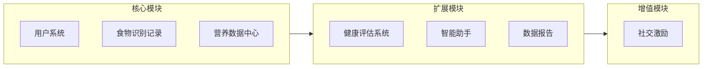
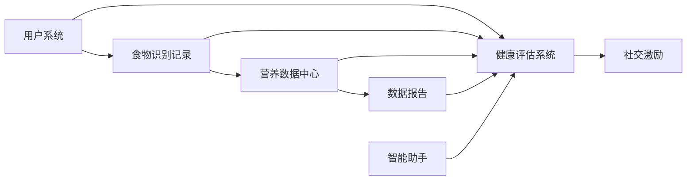
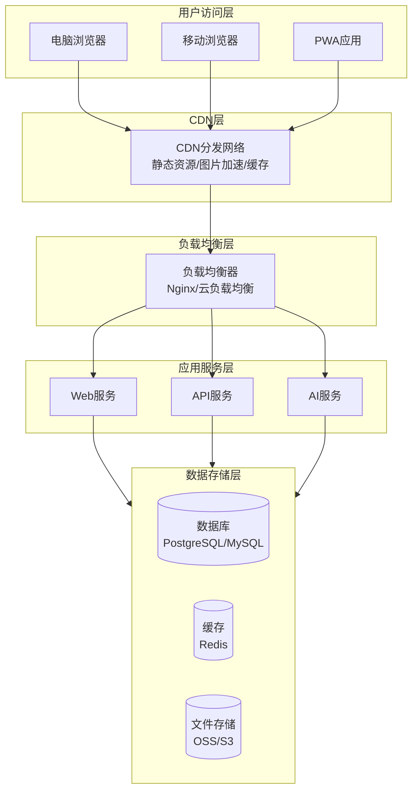

# 营养健康管家 Web应用需求文档 v6.2

## 文档说明

本版本为跨设备网页版,支持电脑端和移动端访问,自适应适配不同设备屏幕尺寸。所有核心功能模块均基于WHO、国家卫健委、中国营养学会、ACSM、ISSN等权威机构发布的最新营养学、健康学及医学专业指南。

***

## 1. 项目概述

### 1.1 项目目标

开发一款功能完善、用户友好的跨设备Web应用:

1. 帮助用户记录日常饮食,监控营养摄入,提供专业的营养建议
2. 通过拍照识别包装食品配料表,快速评估食品健康程度
3. 针对特定人群(减脂、增肌、健康管理)提供个性化营养指导
4. 促进用户养成健康的饮食习惯
5. 支持电脑端和移动端访问,实现跨设备数据同步

### 1.2 目标用户

- 关注健康饮食的普通用户
- 减脂人群:需要控制热量摄入、选择低卡食品的用户
- 增肌人群:需要高蛋白饮食、优化营养配比的用户
- 健康管理人群:有特定健康需求(如糖尿病、高血压)的用户
- 需要进行营养管理的特定群体(如孕妇、老年人等)

### 1.3 平台特性

| 特性    | 说明                                  |
| ----- | ----------------------------------- |
| 跨设备访问 | 支持电脑端(PC/Mac)和移动端(iOS/Android)浏览器访问 |
| 响应式设计 | 自适应适配不同屏幕尺寸,提供最佳用户体验                |
| 数据同步  | 用户数据云端存储,多设备间实时同步                   |
| PWA支持 | 支持渐进式Web应用特性,可添加到主屏幕,支持离线访问         |

***

## 2. 核心营养学标准

### 2.1 能量需求计算标准

**基础代谢率(BMR)计算公式** - Mifflin-St Jeor公式:

```
男性:BMR = (10 × 体重kg) + (6.25 × 身高cm) - (5 × 年龄) + 5
女性:BMR = (10 × 体重kg) + (6.25 × 身高cm) - (5 × 年龄) - 161
```

**每日总能量消耗(TDEE)计算**: TDEE = BMR × 活动系数

| 活动水平 | 活动系数  | 说明         |
| ---- | ----- | ---------- |
| 久坐不动 | 1.2   | 办公室工作,很少运动 |
| 轻度活动 | 1.375 | 每周运动1-3天   |
| 中度活动 | 1.55  | 每周运动3-5天   |
| 高度活动 | 1.725 | 每周运动6-7天   |
| 极度活动 | 1.9   | 每天运动或重体力劳动 |

### 2.2 体重评估标准

**BMI分类标准(中国成人)**:

| 分类   | BMI (kg/m²) | 健康风险   |
| ---- | ----------- | ------ |
| 体重过低 | <18.5       | 营养不良风险 |
| 体重正常 | 18.5-23.9   | 低风险    |
| 超重   | 24.0-27.9   | 增加风险   |
| 肥胖   | ≥28.0       | 高风险    |

### 2.3 营养素推荐摄入比例

**三大营养素供能比**:

| 营养素   | 供能比例    | 说明      |
| ----- | ------- | ------- |
| 碳水化合物 | 50%-65% | 主要能量来源  |
| 蛋白质   | 10%-15% | 一般人群    |
| 脂肪    | 20%-30% | 成人上限30% |

**特殊人群蛋白质需求**:

| 人群类型       | 蛋白质需求 (g/kg体重/天) |
| ---------- | ---------------- |
| 一般成年人      | 0.8              |
| 减脂人群       | 1.2-1.6          |
| 增肌人群       | 1.4-2.0          |
| 老年人(预防肌少症) | 1.2-1.5          |

### 2.4 限盐限糖标准

| 营养素 | 推荐限值           |
| --- | -------------- |
| 食盐  | <5g/天          |
| 钠   | <2000mg/天      |
| 添加糖 | <50g/天(最好<25g) |

***

## 3. 功能架构

### 3.1 功能模块总览



### 3.2 模块依赖关系



***

## 4. 核心功能模块

### 4.1 用户系统

#### 4.1.1 注册与登录

**登录方式**:

| 登录方式  | 说明        | 适用场景        |
| ----- | --------- | ----------- |
| 手机号登录 | 手机号 + 验证码 | 国内用户首选      |
| 邮箱登录  | 邮箱 + 密码   | 海外用户/偏好邮箱用户 |

**注册流程**:

1. 选择登录方式
2. 完成身份验证
3. 填写基本信息(性别、年龄、身高、体重)
4. 设置健康目标
5. 完成注册

#### 4.1.2 个人信息管理

- 基本信息:性别、年龄、身高、体重
- 健康信息:工作强度、健康状况、过敏史
- 联系方式(可选)
- 账户安全:密码修改、绑定手机/邮箱

#### 4.1.3 健康目标设置

**目标类型选择**:

| 目标类型 | 设置内容                   |
| ---- | ---------------------- |
| 减脂   | 目标体重、减脂速度(建议0.5-1kg/周) |
| 增肌   | 目标体重、训练强度              |
| 健康管理 | 关注点(血糖、血压、过敏等)         |
| 维持健康 | 保持当前状态                 |

**系统自动计算**:

| 计算项目          | 计算方法                                |
| ------------- | ----------------------------------- |
| 基础代谢率(BMR)    | Mifflin-St Jeor公式                   |
| 每日总消耗热量(TDEE) | BMR × 活动系数                          |
| 目标热量          | 减脂:TDEE-300\~500kcal增肌:TDEE+300kcal |
| 蛋白质目标         | 减脂:1.2-1.6g/kg增肌:1.4-2.0g/kg        |
| 碳水化合物目标       | 占总能量50%-65%                         |
| 脂肪目标          | 占总能量20%-30%                         |

***

### 4.2 食物识别与记录(核心流程)

#### 4.2.1 统一识别入口

| 识别方式 | 适用场景  | 识别内容                     | 设备适配  |
| ---- | ----- | ------------------------ | ----- |
| 扫码识别 | 包装食品  | 条形码 → 食品信息、配料表、营养成分      | 移动端优先 |
| 拍照识别 | 包装食品  | 配料表图片 → 食品信息、配料表、营养成分    | 移动端优先 |
| 拍照识别 | 非包装食物 | 食物图片 → 食物名称、估算营养成分、热量、重量 | 移动端优先 |
| 图片上传 | 包装食品  | 上传配料表图片 → 识别分析           | 全设备   |
| 手动搜索 | 所有食物  | 关键词搜索 → 食物数据库匹配          | 全设备   |
| 快捷选择 | 常用食物  | 历史/收藏 → 快速添加             | 全设备   |

#### 4.2.2 识别结果页

**核心显示内容**:

- 食物名称 + 食物图片
- 健康评分(带颜色编码)
- 营养成分详情:热量、蛋白质、脂肪、碳水、添加剂、钠、糖
- 针对用户的建议(根据用户目标显示个性化建议)
  - 减脂用户:热量占比、饱腹感
  - 增肌用户:蛋白质密度
  - 健康管理用户:相关指标
- 更健康的选择(可选):推荐替代产品
- 操作按钮:添加到今日记录、收藏、分享
- 咨询AI营养师入口

**关键交互**:

1. 识别成功后,用户可调整份量/数量
2. 点击"添加到今日记录",选择餐次(早餐/午餐/晚餐/加餐)
3. 添加后，系统自动更新今日营养数据

#### 4.2.3 饮食记录管理

- 今日记录:按餐次展示已添加食物
- 历史记录:按日期查看过往记录
- 记录操作:编辑份量、删除记录、复制到今日

***

### 4.3 营养数据中心

#### 4.3.1 今日概览(首页核心)

**核心显示内容**:

- 当前日期
- 热量进度环:已摄入/目标热量、进度百分比、剩余热量
- 三大营养素进度条:蛋白质、脂肪、碳水(带进度条和百分比)
- 关注指标区域(根据用户目标动态显示):
  - 减脂用户:糖摄入进度
  - 增肌用户:蛋白质进度
  - 健康管理用户:钠摄入进度
- 操作按钮:快捷添加食物、查看详情

#### 4.3.2 营养详情页

- 完整营养素列表:蛋白质、脂肪、碳水、膳食纤维、维生素、矿物质
- 添加剂统计:盐、糖、油等
- 与推荐值对比

#### 4.3.3 统一提醒中心

| 提醒类型   | 触发条件           | 提醒内容       |
| ------ | -------------- | ---------- |
| 热量提醒   | 摄入<80%或>110%目标 | 热量不足/超标提醒  |
| 营养素提醒  | 某营养素<70%或>120% | 营养素不足/超标提醒 |
| 添加剂提醒  | 添加剂超标          | 添加剂摄入超标提醒  |
| 饮食规律提醒 | 长时间未进食         | 提醒按时用餐     |
| 钠摄入提醒  | 钠摄入>2000mg     | 钠摄入超标提醒    |
| 糖摄入提醒  | 添加糖>50g        | 糖摄入超标提醒    |

***

## 5. 扩展功能模块

### 5.1 健康评估系统

#### 5.1.1 包装食品健康评分

**评分维度与权重**:

| 评分维度   | 权重  | 评估内容         |
| ------ | --- | ------------ |
| 营养成分比例 | 30% | 三大营养素配比是否合理  |
| 添加剂评估  | 25% | 添加剂种类、数量、安全性 |
| 加工程度   | 20% | NOVA分类等级     |
| 钠含量    | 15% | 钠含量是否超标      |
| 糖含量    | 10% | 添加糖含量        |

**评分输出**:0-10分 + 颜色编码

| 分数区间  | 颜色 | 评价 | 建议    |
| ----- | -- | -- | ----- |
| 8-10分 | 绿色 | 优秀 | 推荐食用  |
| 6-7分  | 黄色 | 良好 | 适量食用  |
| 4-5分  | 橙色 | 一般 | 谨慎食用  |
| 0-3分  | 红色 | 较差 | 不建议食用 |

#### 5.1.2 NOVA食品分类评估

| 分类  | 定义         | 示例                | 健康建议 |
| --- | ---------- | ----------------- | ---- |
| 第一类 | 未加工或最低加工食品 | 新鲜水果、蔬菜、鲜奶、鸡蛋、全谷物 | 推荐为主 |
| 第二类 | 加工烹饪原料     | 植物油、盐、糖、蜂蜜        | 适量使用 |
| 第三类 | 加工食品       | 罐头蔬菜、芝士、烟熏鱼       | 适量食用 |
| 第四类 | 超加工食品      | 汽水、零食、即食面、加工肉制品   | 尽量避免 |

**识别方法**:

- 配料表中含有5种以上成分
- 含有家庭厨房不常用的成分(如高果糖、玉米糖浆、氢化油、人工香精等)
- 含有多种食品添加剂

#### 5.1.3 特定人群评估

##### 5.1.3.1 减脂人群评估

| 评估指标  | 计算方法         | 建议范围          |
| ----- | ------------ | ------------- |
| 热量密度  | kcal/100g    | <150kcal/100g |
| 蛋白质密度 | g蛋白质/100kcal | >8g/100kcal   |
| 饱腹感指数 | 综合评估         | 高纤维、高蛋白       |
| 减脂友好度 | 综合评分         | 0-10分         |

**热量缺口建议**:

- 每日热量缺口:300-500kcal
- 每周减重速度:0.5-1kg(不超过体重的1%)

##### 5.1.3.2 增肌人群评估

| 评估指标  | 计算方法    | 建议范围      |
| ----- | ------- | --------- |
| 蛋白质含量 | g/100g  | >20g/100g |
| 蛋白质质量 | 生物价(BV) | BV>80     |
| 亮氨酸含量 | mg/份    | >2000mg   |
| 训练时机  | 距训练时间   | 训练前后2小时内  |

**蛋白质摄入建议**:

- 每日蛋白质:1.4-2.0g/kg体重
- 每份蛋白质:20-40g优质蛋白
- 摄入频率:每3-4小时一次

##### 5.1.3.3 糖尿病人群评估

| 评估指标       | 分类标准                    |
| ---------- | ----------------------- |
| 血糖生成指数(GI) | 低GI≤55,中GI 56-70,高GI>70 |
| 血糖负荷(GL)   | 低GL≤10,中GL 11-19,高GL≥20 |
| 碳水化合物总量    | 200-300g/天              |
| 膳食纤维       | ≥25g/天                  |

##### 5.1.3.4 高血压人群评估

| 评估指标   | 标准        |
| ------ | --------- |
| 钠含量    | <2000mg/天 |
| 钾含量    | ≥3600mg/天 |
| DASH评分 | 0-10分     |

##### 5.1.3.5 过敏人群评估

**八大过敏原识别**:

| 序号 | 过敏原类别 | 常见食物         |
| -- | ----- | ------------ |
| 1  | 含麸质谷物 | 小麦、黑麦、大麦、燕麦  |
| 2  | 甲壳类动物 | 虾、蟹、龙虾       |
| 3  | 鱼类    | 各种鱼类         |
| 4  | 蛋类    | 鸡蛋、鸭蛋等       |
| 5  | 花生    | 花生及制品        |
| 6  | 大豆    | 大豆及制品        |
| 7  | 乳制品   | 牛奶、奶粉、奶酪等    |
| 8  | 坚果    | 杏仁、腰果、核桃、榛子等 |

**过敏原风险提示**:

- 直接含有:配料表中明确含有过敏原成分
- 可能含有:生产线交叉污染风险提示

#### 5.1.4 替代推荐

- 当食品评分较低时,自动推荐更健康的替代品
- 推荐逻辑:同类食品、更高评分、符合用户目标
- 考虑用户过敏史,排除过敏原食品

***

### 5.2 智能助手(AI营养师)

#### 5.2.1 功能定位

AI营养师是用户获取个性化建议的**唯一入口**,整合以下功能:

- 智能问答:解答营养相关问题
- 个性化建议:根据用户数据生成建议
- 饮食规划:生成个性化饮食计划
- 营养缺口分析:分析并补充建议

#### 5.2.2 交互方式

| 交互方式 | 适用设备  | 说明         |
| ---- | ----- | ---------- |
| 文字输入 | 全设备   | 支持自然语言对话   |
| 语音输入 | 移动端优先 | 语音转文字      |
| 快捷问题 | 全设备   | 预设常见问题快捷入口 |

#### 5.2.3 上下文感知

AI营养师可感知用户数据:

- 当前健康目标
- 今日/本周营养数据
- 最近识别的食物
- 历史饮食记录

#### 5.2.4 专业知识库

| 知识库类型 | 内容来源          | 更新频率  |
| ----- | ------------- | ----- |
| 膳食指南  | 《中国居民膳食指南》    | 每5年更新 |
| 营养素标准 | DRIs、WHO指南    | 定期更新  |
| 疾病营养  | 国家卫健委食养指南     | 按需更新  |
| 运动营养  | ACSM、ISSN立场声明 | 定期更新  |
| 食品安全  | GB标准、食品安全法规   | 按需更新  |

***

### 5.3 数据报告

#### 5.3.1 日报

- 生成时机:每日晚间自动生成
- 报告内容:
  - 今日热量、营养素摄入总结
  - 与目标对比
  - 健康评分
  - 改进建议

#### 5.3.2 周报

- 生成时机:每周一自动生成上周报告
- 报告内容:
  - 本周营养摄入趋势图
  - 平均健康评分
  - 目标达成率
  - 下周建议

#### 5.3.3 趋势分析

- 长期数据可视化
- 营养摄入趋势
- 健康评分趋势
- 目标进度

#### 5.3.4 分享功能

- 支持分享日报/周报到社交平台
- 生成精美分享图片
- 支持微信、QQ、小红书等平台分享

***

## 6. 增值功能模块

### 6.1 社交激励

#### 6.1.1 健康打卡

- 打卡类型:
  - 每日记录打卡:完成当日饮食记录
  - 健康选择打卡:选择健康评分>6分的食品
  - 目标达成打卡:达成当日营养目标
- 打卡奖励:连续打卡获得成就徽章

#### 6.1.2 成就系统

- 成就类型:
  - 记录达人:累计记录天数
  - 健康先锋:选择健康食品次数
  - 目标达成者:达成目标次数
  - 探索家:识别不同种类食品数量

#### 6.1.3 好友互动

- 添加好友
- 查看好友健康评分排行
- 分享健康发现

***

## 7. 响应式设计原则

### 7.1 设备适配

| 设备类型      | 屏幕宽度         | 布局方式          | 交互特点      |
| --------- | ------------ | ------------- | --------- |
| 大屏电脑      | ≥1200px      | 多栏布局,充分利用横向空间 | 鼠标交互,悬停效果 |
| 中屏电脑/平板横屏 | 768px-1199px | 两栏布局          | 鼠标/触摸双适配  |
| 平板竖屏      | 576px-767px  | 单栏布局,部分双栏     | 触摸交互为主    |
| 手机        | <576px       | 单栏布局          | 触摸交互,底部导航 |

### 7.2 导航适配

| 设备  | 导航方式         | 说明           |
| --- | ------------ | ------------ |
| 电脑端 | 左侧固定导航栏      | 始终可见,支持展开/收起 |
| 平板  | 底部导航栏 + 侧边抽屉 | 类似移动端,支持侧滑菜单 |
| 手机  | 底部导航栏        | 固定底部,方便单手操作  |

### 7.3 内容布局适配

| 内容模块 | 电脑端        | 平板        | 手机        |
| ---- | ---------- | --------- | --------- |
| 营养概览 | 多卡片横向排列    | 2列网格      | 单列堆叠      |
| 食物列表 | 表格形式,多列信息  | 卡片列表,精简信息 | 卡片列表,核心信息 |
| 图表展示 | 大尺寸图表,多图并排 | 中等尺寸,单图为主 | 小尺寸,可滑动查看 |
| 表单输入 | 多列布局,标签在左  | 单列布局,标签在上 | 单列布局,紧凑排列 |

### 7.4 交互适配

| 交互元素 | 电脑端       | 移动端        |
| ---- | --------- | ---------- |
| 悬停效果 | 支持,显示详细信息 | 不支持        |
| 右键菜单 | 支持        | 长按替代       |
| 拖拽操作 | 支持鼠标拖拽    | 支持触摸拖拽     |
| 快捷键  | 支持键盘快捷键   | 不支持        |
| 手势操作 | 不支持       | 支持滑动、双指缩放等 |

***

## 8. 技术架构

### 8.1 前端技术

#### 8.1.1 技术栈选型

| 技术领域    | 技术选型                       | 说明            |
| ------- | -------------------------- | ------------- |
| 框架      | React 18 / Vue 3           | 主流前端框架,生态完善   |
| UI组件库   | Ant Design / Element Plus  | 企业级UI组件,支持响应式 |
| 状态管理    | Redux Toolkit / Pinia      | 全局状态管理        |
| 路由      | React Router / Vue Router  | SPA路由管理       |
| HTTP客户端 | Axios                      | API请求封装       |
| 图表库     | ECharts                    | 数据可视化         |
| CSS方案   | Tailwind CSS / CSS Modules | 响应式样式解决方案     |

#### 8.1.2 响应式实现

- **CSS媒体查询**:基于断点的样式适配
- **CSS Grid/Flexbox**:弹性布局系统
- **CSS变量**:主题和尺寸的统一管理
- **Viewport单位**:vw/vh/rem实现弹性尺寸

### 8.2 后端技术

#### 8.2.1 技术栈选型

| 技术领域  | 技术选型                   | 说明               |
| ----- | ---------------------- | ---------------- |
| 运行环境  | Node.js                | 高性能服务端JavaScript |
| Web框架 | Express / Koa / NestJS | RESTful API开发    |
| 数据库   | PostgreSQL / MySQL     | 关系型数据库           |
| 缓存    | Redis                  | 会话管理、数据缓存        |
| 文件存储  | OSS / S3               | 图片、文件云存储         |
| 消息队列  | RabbitMQ / Redis Queue | 异步任务处理           |

#### 8.2.2 API设计

- RESTful API设计规范
- JWT身份认证
- API版本管理
- 请求限流与防护

### 8.3 AI技术

| AI能力  | 技术方案                   | 说明      |
| ----- | ---------------------- | ------- |
| OCR识别 | 百度OCR / 腾讯OCR / 自研模型   | 配料表文字识别 |
| 图像识别  | TensorFlow / PyTorch   | 食物识别    |
| 大语言模型 | GPT-4 / Claude / 国产大模型 | AI营养师   |

### 8.4 部署架构



### 8.5 数据安全

- 数据加密存储(敏感信息AES加密)
- HTTPS全站加密传输
- 访问权限控制(RBAC)
- 定期数据备份
- SQL注入/XSS/CSRF防护
- 隐私合规(符合《个人信息保护法》)

***

## 9. 数据需求

### 9.1 用户数据

```
用户表 (users)
├── 基本信息
│   ├── id: 用户ID (UUID)
│   ├── phone: 手机号 (加密存储)
│   ├── email: 邮箱 (加密存储)
│   ├── password_hash: 密码哈希
│   ├── nickname: 昵称
│   ├── avatar: 头像URL
│   ├── gender: 性别
│   ├── age: 年龄
│   ├── height: 身高(cm)
│   └── weight: 体重(kg)
├── 第三方登录
│   ├── wechat_openid: 微信OpenID
│   ├── qq_openid: QQ OpenID
│   └── other_oauth: 其他第三方登录信息
├── 健康信息
│   ├── activity_level: 活动强度(久坐/轻度/中度/高度/极度)
│   ├── health_conditions: 健康状况[](糖尿病/高血压/高血脂等)
│   └── allergies: 过敏史[](八大过敏原)
├── 目标设置
│   ├── goal_type: 目标类型(减脂/增肌/健康/维持)
│   ├── target_weight: 目标体重
│   ├── weekly_target: 每周目标(减脂:0.5-1kg)
│   ├── daily_calorie_goal: 每日热量目标
│   └── nutrition_goals: 营养素目标{}
└── 计算数据
    ├── bmr: 基础代谢率(Mifflin-St Jeor公式)
    ├── tdee: 每日总消耗
    ├── bmi: 体质指数
    └── bmi_category: BMI分类
```

### 9.2 食物数据

```
食物表 (foods)
├── 基本信息
│   ├── id: 食物ID
│   ├── name: 食物名称
│   ├── category: 分类
│   ├── image: 图片URL
│   └── barcode: 条形码(包装食品)
├── 营养成分(每100g)
│   ├── calories: 热量(kcal)
│   ├── protein: 蛋白质(g)
│   ├── fat: 脂肪(g)
│   ├── saturated_fat: 饱和脂肪(g)
│   ├── carbs: 碳水化合物(g)
│   ├── fiber: 膳食纤维(g)
│   ├── sugar: 糖(g)
│   ├── sodium: 钠(mg)
│   ├── potassium: 钾(mg)
│   ├── vitamins: 维生素{}
│   └── minerals: 矿物质{}
├── 添加剂信息
│   ├── additives: 添加剂列表[]
│   └── additive_count: 添加剂数量
├── 配料信息(包装食品)
│   ├── ingredients: 配料表
│   └── allergens: 过敏原[]
├── 评估数据
│   ├── health_score: 健康评分(0-10)
│   ├── nova_class: NOVA分类(1-4)
│   ├── glycemic_index: 血糖指数(GI)
│   ├── glycemic_load: 血糖负荷(GL)
│   └── protein_quality: 蛋白质质量(BV)
└── 特定人群评分
    ├── weight_loss_score: 减脂友好度
    ├── muscle_gain_score: 增肌友好度
    ├── diabetes_score: 糖尿病友好度
    └── hypertension_score: 高血压友好度
```

### 9.3 记录数据

```
饮食记录表 (diet_records)
├── user_id: 用户ID
├── date: 日期
├── meal_type: 餐次(早餐/午餐/晚餐/加餐)
├── foods[]
│   ├── food_id: 食物ID
│   ├── amount: 份量(g)
│   └── nutrients: 营养素快照{}
└── created_at: 创建时间
```

***

## 10. 非功能需求

### 10.1 性能需求

| 性能指标         | 目标值      | 说明         |
| ------------ | -------- | ---------- |
| 首屏加载时间       | ≤ 2秒     | 包含关键渲染路径优化 |
| 页面切换时间       | ≤ 0.5秒   | SPA路由切换    |
| API响应时间      | ≤ 500ms  | 95%请求      |
| 图片加载时间       | ≤ 1秒     | CDN加速后     |
| 并发用户数        | ≥ 50000人 | 高峰期支持      |
| 包装食品配料表识别准确率 | ≥ 85%    | OCR识别      |

### 10.2 专业准确性需求

#### 10.2.1 能量计算准确性

| 计算项目   | 准确性要求    | 验证方法     |
| ------ | -------- | -------- |
| BMR计算  | 误差 ≤ 5%  | 与间接量热法对比 |
| TDEE计算 | 误差 ≤ 10% | 与双标水法对比  |
| 热量累加   | 误差 ≤ 2%  | 单元测试验证   |

#### 10.2.2 营养素计算准确性

| 营养素     | 准确性要求    | 说明           |
| ------- | -------- | ------------ |
| 三大营养素   | 误差 ≤ 5%  | 蛋白质、脂肪、碳水化合物 |
| 微量营养素   | 误差 ≤ 10% | 维生素、矿物质      |
| GI/GL计算 | 误差 ≤ 10% | 血糖指数、血糖负荷    |

#### 10.2.3 健康评估准确性

| 评估项目   | 准确性要求           | 验证方法    |
| ------ | --------------- | ------- |
| 食品健康评分 | 与专家评分一致性 ≥ 80%  | 专家评审对比  |
| NOVA分类 | 准确率 ≥ 85%       | 人工标注对比  |
| 过敏原识别  | 准确率 ≥ 95%       | 配料表人工核对 |
| 特定人群评估 | 与营养师建议一致性 ≥ 75% | 专业营养师评审 |

### 10.3 安全性需求

| 安全需求    | 说明                 |
| ------- | ------------------ |
| 数据传输加密  | 全站HTTPS,TLS 1.2+   |
| 密码安全    | bcrypt加密存储,强度≥12   |
| 会话管理    | JWT Token,支持刷新机制   |
| 敏感数据保护  | 手机号、邮箱脱敏显示         |
| SQL注入防护 | 参数化查询,ORM框架        |
| XSS防护   | 输入过滤,输出编码          |
| CSRF防护  | Token验证            |
| 隐私合规    | 符合《个人信息保护法》《网络安全法》 |

### 10.4 兼容性需求

#### 10.4.1 浏览器兼容性

| 浏览器     | 支持版本   | 说明      |
| ------- | ------ | ------- |
| Chrome  | 最新2个版本 | 主要支持    |
| Safari  | 最新2个版本 | 主要支持    |
| Firefox | 最新2个版本 | 主要支持    |
| Edge    | 最新2个版本 | 主要支持    |
| 微信内置浏览器 | 支持     | 移动端重要入口 |
| QQ内置浏览器 | 支持     | 移动端入口   |

#### 10.4.2 设备兼容性

| 设备类型      | 操作系统         | 说明    |
| --------- | ------------ | ----- |
| PC        | Windows 10+  | 全功能支持 |
| Mac       | macOS 10.15+ | 全功能支持 |
| iPhone    | iOS 13+      | 全功能支持 |
| Android手机 | Android 8+   | 全功能支持 |
| iPad      | iPadOS 13+   | 全功能支持 |
| Android平板 | Android 8+   | 全功能支持 |

### 10.5 PWA需求

| PWA特性 | 说明           |
| ----- | ------------ |
| 可安装   | 支持添加到主屏幕/桌面  |
| 离线访问  | 核心页面支持离线访问   |
| 推送通知  | 支持Web Push通知 |
| 后台同步  | 支持后台数据同步     |
| 应用图标  | 提供各尺寸应用图标    |

***

## 11. 需求优先级

### 11.1 P0(必须实现 - MVP)

- 用户系统:注册登录、个人信息、目标设置
- 食物识别记录:扫码、拍照、手动搜索、添加记录
- 营养数据中心:今日概览、热量/营养监控
- 健康评估:基础健康评分
- 响应式布局:移动端/电脑端适配

### 11.2 P1(重要功能)

- 特定人群评估功能
- AI营养师基础问答
- 替代推荐
- 统一提醒中心
- PWA基础功能

### 11.3 P2(次要功能)

- 数据报告:日报、周报
- 历史记录管理
- 收藏功能
- 趋势分析
- 暗色模式

### 11.4 P3(可选功能)

- 社交激励:打卡、成就、好友
- 分享功能
- 高级AI功能
- Web Push推送

***

## 12. 附录

### 12.1 术语定义

| 术语     | 定义                        |
| ------ | ------------------------- |
| BMR    | 基础代谢率,人体在安静状态下维持生命所需的最低能量 |
| TDEE   | 每日总消耗热量,包括基础代谢、运动消耗和食物热效应 |
| BMI    | 体质指数,体重(kg)/身高(m)²        |
| GI     | 血糖生成指数,衡量食物对血糖影响程度的指标     |
| GL     | 血糖负荷,反映摄入全部碳水化合物对血糖的影响    |
| NOVA分类 | 根据食品加工程度对食品进行分类的系统        |
| DASH饮食 | 防治高血压饮食法,富含蔬果、低脂乳制品、全谷物   |
| ISSN   | 国际运动营养学会                  |
| ACSM   | 美国运动医学会                   |
| DRIs   | 膳食营养素参考摄入量                |
| PWA    | 渐进式Web应用,支持离线访问和安装到主屏幕    |
| SPA    | 单页应用,页面无刷新切换              |
| JWT    | JSON Web Token,用于身份认证     |

### 12.2 参考资料

- 《中国居民膳食指南(2022)》- 中国营养学会
- 《中国居民膳食营养素参考摄入量(2013)》- 中国营养学会
- 《成人糖尿病食养指南(2023年版)》- 国家卫生健康委
- 《成人高血压食养指南(2023年版)》- 国家卫生健康委
- WHO《健康饮食》指南 - 世界卫生组织
- WHO《成人和儿童糖摄入量指南》- 世界卫生组织
- WHO《成人和儿童钠摄入量指南》- 世界卫生组织
- ACSM《营养与运动表现》立场声明 - 美国运动医学会
- ISSN《蛋白质与运动》立场声明 - 国际运动营养学会
- NOVA食品分类系统 - FAO
- GB 2760《食品安全国家标准 食品添加剂使用标准》
- GB 7718《预包装食品标签通则》
- MDN Web Docs - 响应式设计
- Google PWA指南

***

## 版本历史

| 版本   | 日期         | 变更内容                                                                               |
| ---- | ---------- | ---------------------------------------------------------------------------------- |
| v6.2 | 2024-03-29 | 精简版:删除重复内容和与UI设计、代码实现无关的部分,突出核心功能和技术实现要点,保留关键的营养学标准和数据结构设计                         |
| v6.0 | 2024-03-28 | 从微信小程序版本升级为跨设备Web应用版本;新增响应式设计和跨设备适配需求;更新技术架构为Web技术栈;更新用户登录方式;新增PWA支持;完善浏览器和设备兼容性需求 |

